---
tags:
  - nuclearwinter
  - design
created: 2026-03-08T22:17:00
---

# Nuclear Winter — Class Relationship Diagram

> [!NOTE]
> This diagram is derived from the [[Code Components]] and [[Design Document]] for the NeoForge 1.21.1 mod.

```mermaid
classDiagram
    direction TB

    class NuclearWinter {
        -StageManager stageManager$
        -Configuration config$
        -EffectsGenerator effectsGenerator$
        -BlockResolver blockResolver$
        +init()
        +registerEvents()
        +registerCommands()
        +getStageManager()$ StageManager
        +getConfig()$ Configuration
        +getEffectsGenerator()$ EffectsGenerator
        +getBlockResolver()$ BlockResolver
    }

    class StageManager {
        <<static / singleton>>
        -Map~ResourceKey~Level~, StageBase~ activeStages
        +onWorldLoad(Level)
        +onWorldUnload(Level)
        +loadWorldAttachment(Level)
        +advanceStage(ResourceKey~Level~)
        +unloadStage(ResourceKey~Level~, StageBase)
        +loadStage(ResourceKey~Level~, StageBase)
        +tickAllStages()
        +getStageForWorld(ResourceKey~Level~) StageBase
    }

    class StageBase {
        <<abstract>>
        #long initTickTime
        #long stageDuration
        #double skyEmission
        #boolean chunkNukingEnabled
        +init()*
        +tick()*
        +unload()*
        +getSkyEmission() double
        +getDuration() long
    }

    class Stage0 {
        +init()
        +tick()
        +unload()
    }

    class Stage1 {
        -double skyEmission = 28
        +init()
        +tick()
        +unload()
    }

    class Stage2 {
        -double skyEmission = 83
        -ChunkProcessor chunkProcessor
        +init()
        +tick()
        +unload()
    }

    class Stage3 {
        -double skyEmission = 333
        -ChunkProcessor chunkProcessor
        +init()
        +tick()
        +unload()
    }

    class Stage4 {
        -double skyEmission = 5000
        -ChunkProcessor chunkProcessor
        -boolean radStormsEnabled
        +init()
        +tick()
        +unload()
    }

    class ChunkProcessor {
        -RadiationEmitter radiationEmitter
        -boolean chunkNukingEnabled
        +processChunk(LevelChunk)
        +rainRadiation(LevelChunk)
        +nukeChunk(LevelChunk)
        +isChunkNuked(LevelChunk) boolean
        +markChunkNuked(LevelChunk)
        +degradeBlock(BlockPos, int stageIndex)
    }

    class RadiationEmitter {
        -double floorConstant = 50
        +raycastDown(Level, BlockPos) double
        +calculateRadiation(double currentRad, double blockResistance) double
        +getSkyEmission(int stage) double
    }

    class PlayerRadHandler {
        -RadiationEmitter radiationEmitter
        -BlockPos cachedBlockPos
        -double cachedExposure
        +onPlayerTick(Player)
        +calculateExposure(Player) double
        +applyThresholdEffects(Player)
        +getCurrentTier(Player) RadiationTier
        +drainPool(Player, double amount)
        +isExposed(Player) boolean
    }

    class PlayerDataAttachment {
        <<Data Attachment>>
        -double radiationPool
        +getRadiationPool() double
        +setRadiationPool(double)
        +serializeNBT() CompoundTag
        +deserializeNBT(CompoundTag)
    }

    class RadiationTier {
        <<enumeration>>
        CLEAN       %% 0-15%
        CONTAMINATED %% 15-35%
        IRRADIATED  %% 35-60%
        POISONED    %% 60-80%
        CRITICAL    %% 80-99%
        FATAL       %% 100%
        +getMinPercent() double
        +getMaxPercent() double
        +getEffects() List~MobEffect~
    }

    class EffectsGenerator {
        <<static / singleton>>
        +applyRadStorm(Level)
        +applyPlayerEffects(Player, RadiationTier)
        +applyVignette(Player)
        +applyBlindness(Player)
        +applyNausea(Player)
        +applyWeakness(Player)
        +applyDamage(Player, double hpPerSec)
    }

    class NuclearWinterCommand {
        <<abstract>>
        +register(CommandDispatcher)
    }

    class StatusCommand {
        +execute(CommandContext) int
    }

    class StartCommand {
        +execute(CommandContext) int
    }

    class StopCommand {
        +execute(CommandContext) int
    }

    class SetStageCommand {
        +execute(CommandContext) int
    }

    class Configuration {
        <<static / singleton>>
        +double[] skyEmissions
        +long[] stageDurations
        +double floorConstant
        +double playerPoolMax
        +double passiveDrainRate
        +double[] thresholdPercents
        +double[] suitProtections
        +double dosimeterFullRed
        +Map~String, Double~ resistanceConfig
        +Map~String, String~ degradationStage2Config
        +Map~String, String~ degradationStage4Config
        +double radAwayReduction
        +int radAwayDuration
    }

    class BlockResolver {
        <<static / singleton>>
        -Map~Block, Double~ blockOverrides
        -Map~TagKey~Block~, Double~ tagResistanceMap
        -Map~Block, Block~ blockDegradationOverrides
        -Map~TagKey~Block~, Block~ tagDegradationMap
        -double defaultResistance = 1.0
        +init(Configuration)$
        +getResistance(BlockState)$ double
        +getDegradedBlock(BlockState, int stage)$ Block
    }

    class WorldDataAttachment {
        <<Data Attachment>>
        -int currentStageIndex
        -long stageStartTick
        +getStageIndex() int
        +setStageIndex(int)
        +getStageStartTick() long
        +setStageStartTick(long)
        +serializeNBT() CompoundTag
        +deserializeNBT(CompoundTag)
    }

    class ChunkDataAttachment {
        <<Data Attachment>>
        -boolean nuked
        +isNuked() boolean
        +setNuked(boolean)
        +serializeNBT() CompoundTag
        +deserializeNBT(CompoundTag)
    }

    class GeigerCounterItem {
        +use(Level, Player, InteractionHand) InteractionResultHolder
        +displayRadsPerSec(Player, double)
    }

    class DosimeterItem {
        +inventoryTick(ItemStack, Level, Entity, int, boolean)
        +getColorForRads(double) int
    }

    class RadAwayItem {
        +use(Level, Player, InteractionHand) InteractionResultHolder
    }

    class RadAwayEffect {
        <<MobEffect>>
        -double drainPerTick
        +applyEffectTick(LivingEntity, int amplifier)
        +shouldApplyEffectTickThisTick(int duration, int amplifier) boolean
    }

    class HazmatSuit {
        -int tier
        -double protection
        +getProtection() double
        +getTier() int
    }

    class GrassSpreadMixin {
        <<Mixin>>
        +onRandomTick()
    }

    %% ── Custom Blocks ──

    class DeadGrassBlock {
        <<Block>>
    }

    class DeadLeavesBlock {
        <<Block>>
    }

    class ParchedDirtBlock {
        <<Block>>
    }

    class WastelandDustBlock {
        <<FallingBlock>>
    }

    class CrackedStoneBlock {
        <<Block>>
    }

    class WastelandRubbleBlock {
        <<Block>>
    }

    class DeadwoodBlock {
        <<Block>>
    }

    class RuinedPlanksBlock {
        <<Block>>
    }

    class LeadBlock {
        <<Block>>
    }

    class ReinforcedConcreteBlock {
        <<Block>>
    }

    %% ── Inheritance ──
    StageBase <|-- Stage0
    StageBase <|-- Stage1
    StageBase <|-- Stage2
    StageBase <|-- Stage3
    StageBase <|-- Stage4
    NuclearWinterCommand <|-- StatusCommand
    NuclearWinterCommand <|-- StartCommand
    NuclearWinterCommand <|-- StopCommand
    NuclearWinterCommand <|-- SetStageCommand

    %% ── Composition / Ownership ──
    NuclearWinter *-- StageManager : owns static
    NuclearWinter *-- Configuration : owns static
    NuclearWinter *-- EffectsGenerator : owns static
    NuclearWinter *-- BlockResolver : owns static
    StageManager *-- StageBase : manages per-dimension

    %% ── Dependencies / Associations ──
    Stage2 --> ChunkProcessor : uses
    Stage3 --> ChunkProcessor : uses
    Stage4 --> ChunkProcessor : uses
    ChunkProcessor --> RadiationEmitter : delegates raycasting
    ChunkProcessor --> ChunkDataAttachment : reads/writes NBT
    ChunkProcessor --> BlockResolver : resolves degradation
    PlayerRadHandler --> RadiationEmitter : delegates raycasting
    PlayerRadHandler --> PlayerDataAttachment : reads/writes player state
    PlayerRadHandler --> RadiationTier : resolves tier
    PlayerRadHandler --> EffectsGenerator : triggers effects
    RadiationEmitter --> BlockResolver : resolves resistance
    BlockResolver --> Configuration : parses raw config
    StageManager --> WorldDataAttachment : loads/saves stage NBT
    NuclearWinter --> NuclearWinterCommand : registers
    GeigerCounterItem --> RadiationEmitter : queries Rads/sec
    DosimeterItem --> PlayerRadHandler : reads pool
    RadAwayItem --> RadAwayEffect : applies effect
    RadAwayEffect --> PlayerDataAttachment : drains pool
    HazmatSuit --> PlayerRadHandler : reduces exposure
    GrassSpreadMixin ..> StageManager : checks stage >= 1
    StageManager --> Configuration : reads durations
```

## Key Relationships

| Relationship | Description |
|---|---|
| **NuclearWinter -> StageManager** | Main mod class owns and initializes the stage manager |
| **StageManager -> StageBase** | Manages lifecycle per dimension via `Map<ResourceKey<Level>, StageBase>` |
| **Stage0-4 <- StageBase** | All concrete stages inherit abstract stage behavior |
| **Stages 2-4 -> ChunkProcessor** | Higher stages use the chunk processor for surface degradation and nuking |
| **ChunkProcessor -> BlockResolver** | Resolves degradation targets (e.g., grass-type -> DeadGrassBlock at Stage 2) |
| **RadiationEmitter -> BlockResolver** | Resolves block resistance values during raycast (tag -> individual -> default) |
| **BlockResolver -> Configuration** | Parses `#tag` / `block:id` string config into runtime lookup maps |
| **PlayerRadHandler -> PlayerDataAttachment** | Reads/writes the player's persisted radiation pool |
| **RadAwayItem -> RadAwayEffect** | Item applies a custom MobEffect; effect drains pool via PlayerDataAttachment |
| **WorldDataAttachment / ChunkDataAttachment / PlayerDataAttachment** | NeoForge data attachments for stage, chunk-nuked, and player radiation state |
| **Commands -> StageManager** | Admin commands (`/nuclearwinter start overworld`) drive stage transitions per dimension |
| **GrassSpreadMixin -> StageManager** | Mixin checks if staging >= 1 to suppress grass spread |

## Custom Blocks

| Block | Parent | Degradation Path | Notes |
|---|---|---|---|
| `DeadGrassBlock` | `Block` | Grass -> **Stage 2** | Grey-brown dying grass |
| `DeadLeavesBlock` | `Block` | Leaves -> **Stage 2** -> Air at Stage 4 | Browning, transitional |
| `ParchedDirtBlock` | `Block` | Dirt -> **Stage 2** | Greyed, desiccated dirt |
| `WastelandDustBlock` | `FallingBlock` | Grass/Dirt -> **Stage 4** | Gravity-affected like sand |
| `CrackedStoneBlock` | `Block` | Stone -> **Stage 2** | Visually fractured |
| `WastelandRubbleBlock` | `Block` | Stone -> **Stage 4** | Collapsed stone debris |
| `DeadwoodBlock` | `Block` | Logs -> **Stage 2** | Drops nothing; no further degradation |
| `RuinedPlanksBlock` | `Block` | Planks -> **Stage 2** | Retains collision; no further degradation |
| `LeadBlock` | `Block` | -- | Crafted; 16.0 resistance (best shielding) |
| `ReinforcedConcreteBlock` | `Block` | -- | Crafted; 2.5 resistance (mid-tier shielding) |

> [!IMPORTANT]
> In NeoForge 1.21.1, the old Forge Capability system is replaced by **Data Attachments** (`AttachmentType`). `WorldDataAttachment`, `ChunkDataAttachment`, and `PlayerDataAttachment` are implemented as `AttachmentType<T>` registered via `RegisterAttachmentTypesEvent`.
