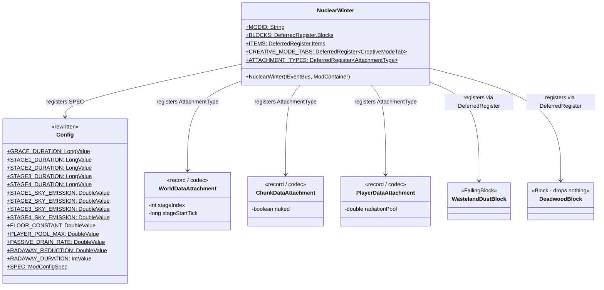

# Phase 1: Foundation — Implementation Plan

> **For Claude:** REQUIRED SUB-SKILL: Use superpowers:executing-plans to implement this plan task-by-task.
>
> **After each task:** Stop for user verification before proceeding to the next task.

**Goal:** Strip the example code and replace it with the real mod infrastructure — configuration, custom blocks, data attachment types, and a creative tab.

**Architecture:** The existing `NuclearWinter.java` entry point keeps its `DeferredRegister` pattern but all example objects are removed and replaced with real block/item registrations. `Config.java` is rewritten to hold every configurable value from the design document. Three NeoForge Data Attachment types are registered for world-level, chunk-level, and player-level persistent state.

**Tech Stack:** NeoForge 21.1.219, Minecraft 1.21.1, Java 21, `ModConfigSpec`, `DeferredRegister`, `AttachmentType`

---

## Class Diagram — What This Phase Adds



---

## Task 1: Remove example code from NuclearWinter.java

**Files:**
- Modify: `src/main/java/net/tomato3017/nuclearwinter/NuclearWinter.java`

**Step 1: Remove example registrations and methods**

Remove the following from `NuclearWinter.java`:
- `EXAMPLE_BLOCK` field
- `EXAMPLE_BLOCK_ITEM` field
- `EXAMPLE_ITEM` field
- `EXAMPLE_TAB` field
- `commonSetup()` method body (keep the method as an empty stub for now)
- `addCreative()` method and its listener registration in the constructor
- All imports that become unused after these removals (`FoodProperties`, `CreativeModeTabs`, `BuiltInRegistries`, `Blocks`, `MapColor`, `BlockBehaviour`)

After removal, `NuclearWinter.java` should contain only: `MODID`, `LOGGER`, the three `DeferredRegister` fields (BLOCKS, ITEMS, CREATIVE_MODE_TABS), constructor with register calls + NeoForge event bus registration + config registration, an empty `commonSetup`, and `onServerStarting`.

**Step 2: Verify it compiles**

Run: `./gradlew build`
Expected: BUILD SUCCESSFUL (with warnings about unused imports at most)


---

## Task 2: Rewrite Config.java with all design document values

**Files:**
- Modify: `src/main/java/net/tomato3017/nuclearwinter/Config.java`

**Step 1: Write GameTest class (for future use)**

Create a GameTest that verifies config defaults load correctly:

**Files:**
- Create: `src/main/java/net/tomato3017/nuclearwinter/test/ConfigGameTest.java`

```java
package net.tomato3017.nuclearwinter.test;

import net.tomato3017.nuclearwinter.Config;
import net.minecraft.gametest.framework.GameTest;
import net.minecraft.gametest.framework.GameTestHelper;
import net.neoforged.neoforge.gametest.GameTestHolder;
import net.neoforged.neoforge.gametest.PrefixGameTestTemplate;

@GameTestHolder("nuclearwinter")
@PrefixGameTestTemplate(false)
public class ConfigGameTest {

    @GameTest(template = "empty_1x1")
    public void configDefaults(GameTestHelper helper) {
        helper.assertTrue(Config.FLOOR_CONSTANT.get() == 50.0, "Floor constant should be 50");
        helper.assertTrue(Config.PLAYER_POOL_MAX.get() == 100000.0, "Pool max should be 100000");
        helper.assertTrue(Config.PASSIVE_DRAIN_RATE.get() == 100.0, "Drain rate should be 100");
        helper.assertTrue(Config.STAGE1_SKY_EMISSION.get() == 28.0, "Stage 1 emission should be 28");
        helper.succeed();
    }
}
```

> **Note:** GameTest execution is skipped for now (no test structure template available). The test class is written for future use. Verify correctness via `./gradlew build` and manual testing.

**Step 2: Rewrite Config.java**

Replace the entire contents of `Config.java`:

```java
package net.tomato3017.nuclearwinter;

import net.neoforged.neoforge.common.ModConfigSpec;

public class Config {
    private static final ModConfigSpec.Builder BUILDER = new ModConfigSpec.Builder();

    // --- Staging Durations (ticks; 20 ticks = 1 second) ---
    // 3 hours = 216,000 ticks
    public static final ModConfigSpec.LongValue GRACE_DURATION;
    public static final ModConfigSpec.LongValue STAGE1_DURATION;
    public static final ModConfigSpec.LongValue STAGE2_DURATION;
    public static final ModConfigSpec.LongValue STAGE3_DURATION;
    public static final ModConfigSpec.LongValue STAGE4_DURATION;

    // --- Sky Emission (Rads/sec) ---
    public static final ModConfigSpec.DoubleValue STAGE1_SKY_EMISSION;
    public static final ModConfigSpec.DoubleValue STAGE2_SKY_EMISSION;
    public static final ModConfigSpec.DoubleValue STAGE3_SKY_EMISSION;
    public static final ModConfigSpec.DoubleValue STAGE4_SKY_EMISSION;

    // --- Radiation ---
    public static final ModConfigSpec.DoubleValue FLOOR_CONSTANT;
    public static final ModConfigSpec.IntValue RAYCAST_INTERVAL_TICKS;

    // --- Player ---
    public static final ModConfigSpec.DoubleValue PLAYER_POOL_MAX;
    public static final ModConfigSpec.DoubleValue PASSIVE_DRAIN_RATE;

    // --- Thresholds (percent of pool max) ---
    public static final ModConfigSpec.DoubleValue THRESHOLD_CONTAMINATED;
    public static final ModConfigSpec.DoubleValue THRESHOLD_IRRADIATED;
    public static final ModConfigSpec.DoubleValue THRESHOLD_POISONED;
    public static final ModConfigSpec.DoubleValue THRESHOLD_CRITICAL;

    // --- RadAway ---
    public static final ModConfigSpec.DoubleValue RADAWAY_REDUCTION;
    public static final ModConfigSpec.IntValue RADAWAY_DURATION_TICKS;

    // --- Equipment ---
    public static final ModConfigSpec.DoubleValue DOSIMETER_FULL_RED;
    public static final ModConfigSpec.DoubleValue SUIT_TIER1_PROTECTION;
    public static final ModConfigSpec.DoubleValue SUIT_TIER2_PROTECTION;
    public static final ModConfigSpec.DoubleValue SUIT_TIER3_PROTECTION;

    // --- Block Resistance ---
    public static final ModConfigSpec.DoubleValue RESISTANCE_DIRT;
    public static final ModConfigSpec.DoubleValue RESISTANCE_WOOD;
    public static final ModConfigSpec.DoubleValue RESISTANCE_STONE;
    public static final ModConfigSpec.DoubleValue RESISTANCE_DEEPSLATE;
    public static final ModConfigSpec.DoubleValue RESISTANCE_REINFORCED_CONCRETE;
    public static final ModConfigSpec.DoubleValue RESISTANCE_IRON;
    public static final ModConfigSpec.DoubleValue RESISTANCE_WATER;
    public static final ModConfigSpec.DoubleValue RESISTANCE_LEAD;

    static {
        BUILDER.push("staging");
        GRACE_DURATION = BUILDER.comment("Grace period duration in ticks (default 3h = 216000)")
                .defineInRange("graceDuration", 216_000L, 0L, Long.MAX_VALUE);
        STAGE1_DURATION = BUILDER.comment("Stage 1 duration in ticks (default 3h = 216000)")
                .defineInRange("stage1Duration", 216_000L, 0L, Long.MAX_VALUE);
        STAGE2_DURATION = BUILDER.comment("Stage 2 duration in ticks (default 2.5h = 180000)")
                .defineInRange("stage2Duration", 180_000L, 0L, Long.MAX_VALUE);
        STAGE3_DURATION = BUILDER.comment("Stage 3 duration in ticks (default 2h = 144000)")
                .defineInRange("stage3Duration", 144_000L, 0L, Long.MAX_VALUE);
        STAGE4_DURATION = BUILDER.comment("Stage 4 duration in ticks (default 1.5h = 108000)")
                .defineInRange("stage4Duration", 108_000L, 0L, Long.MAX_VALUE);
        BUILDER.pop();

        BUILDER.push("radiation");
        STAGE1_SKY_EMISSION = BUILDER.comment("Stage 1 sky radiation emission (Rads/sec)")
                .defineInRange("stage1SkyEmission", 28.0, 0.0, Double.MAX_VALUE);
        STAGE2_SKY_EMISSION = BUILDER.comment("Stage 2 sky radiation emission (Rads/sec)")
                .defineInRange("stage2SkyEmission", 83.0, 0.0, Double.MAX_VALUE);
        STAGE3_SKY_EMISSION = BUILDER.comment("Stage 3 sky radiation emission (Rads/sec)")
                .defineInRange("stage3SkyEmission", 333.0, 0.0, Double.MAX_VALUE);
        STAGE4_SKY_EMISSION = BUILDER.comment("Stage 4 sky radiation emission (Rads/sec)")
                .defineInRange("stage4SkyEmission", 5000.0, 0.0, Double.MAX_VALUE);
        FLOOR_CONSTANT = BUILDER.comment("Radiation floor constant (Rads). Raycast exits below this.")
                .defineInRange("floorConstant", 50.0, 0.0, Double.MAX_VALUE);
        RAYCAST_INTERVAL_TICKS = BUILDER.comment("Ticks between radiation raycasts per player")
                .defineInRange("raycastIntervalTicks", 10, 1, 100);
        BUILDER.pop();

        BUILDER.push("player");
        PLAYER_POOL_MAX = BUILDER.comment("Maximum radiation pool capacity (Rads)")
                .defineInRange("poolMax", 100_000.0, 1.0, Double.MAX_VALUE);
        PASSIVE_DRAIN_RATE = BUILDER.comment("Passive radiation drain rate when unexposed (Rads/sec)")
                .defineInRange("passiveDrainRate", 100.0, 0.0, Double.MAX_VALUE);
        BUILDER.pop();

        BUILDER.push("thresholds");
        THRESHOLD_CONTAMINATED = BUILDER.comment("Contaminated threshold (percent of pool)")
                .defineInRange("contaminated", 0.15, 0.0, 1.0);
        THRESHOLD_IRRADIATED = BUILDER.comment("Irradiated threshold (percent of pool)")
                .defineInRange("irradiated", 0.35, 0.0, 1.0);
        THRESHOLD_POISONED = BUILDER.comment("Poisoned threshold (percent of pool)")
                .defineInRange("poisoned", 0.60, 0.0, 1.0);
        THRESHOLD_CRITICAL = BUILDER.comment("Critical threshold (percent of pool)")
                .defineInRange("critical", 0.80, 0.0, 1.0);
        BUILDER.pop();

        BUILDER.push("radaway");
        RADAWAY_REDUCTION = BUILDER.comment("Total Rads removed by one RadAway over its duration")
                .defineInRange("reduction", 50_000.0, 0.0, Double.MAX_VALUE);
        RADAWAY_DURATION_TICKS = BUILDER.comment("RadAway effect duration in ticks (default 3 min = 3600)")
                .defineInRange("durationTicks", 3600, 1, Integer.MAX_VALUE);
        BUILDER.pop();

        BUILDER.push("equipment");
        DOSIMETER_FULL_RED = BUILDER.comment("Dosimeter shows full red at this Rad value")
                .defineInRange("dosimeterFullRed", 80_000.0, 1.0, Double.MAX_VALUE);
        SUIT_TIER1_PROTECTION = BUILDER.comment("Hazmat Suit Tier 1 radiation reduction (0.0 to 1.0)")
                .defineInRange("suitTier1Protection", 0.67, 0.0, 1.0);
        SUIT_TIER2_PROTECTION = BUILDER.comment("Hazmat Suit Tier 2 radiation reduction (0.0 to 1.0)")
                .defineInRange("suitTier2Protection", 0.92, 0.0, 1.0);
        SUIT_TIER3_PROTECTION = BUILDER.comment("Hazmat Suit Tier 3 radiation reduction (0.0 to 1.0)")
                .defineInRange("suitTier3Protection", 0.99, 0.0, 1.0);
        BUILDER.pop();

        BUILDER.push("blockResistance");
        RESISTANCE_DIRT = BUILDER.comment("Dirt/gravel radiation resistance modifier")
                .defineInRange("dirt", 0.5, 0.01, 100.0);
        RESISTANCE_WOOD = BUILDER.comment("Wood radiation resistance modifier")
                .defineInRange("wood", 0.6, 0.01, 100.0);
        RESISTANCE_STONE = BUILDER.comment("Stone radiation resistance modifier (baseline)")
                .defineInRange("stone", 1.0, 0.01, 100.0);
        RESISTANCE_DEEPSLATE = BUILDER.comment("Deepslate/obsidian radiation resistance modifier")
                .defineInRange("deepslate", 2.0, 0.01, 100.0);
        RESISTANCE_REINFORCED_CONCRETE = BUILDER.comment("Reinforced concrete radiation resistance modifier")
                .defineInRange("reinforcedConcrete", 2.5, 0.01, 100.0);
        RESISTANCE_IRON = BUILDER.comment("Iron block radiation resistance modifier")
                .defineInRange("iron", 4.0, 0.01, 100.0);
        RESISTANCE_WATER = BUILDER.comment("Water radiation resistance modifier")
                .defineInRange("water", 8.0, 0.01, 100.0);
        RESISTANCE_LEAD = BUILDER.comment("Lead block radiation resistance modifier")
                .defineInRange("lead", 16.0, 0.01, 100.0);
        BUILDER.pop();
    }

    static final ModConfigSpec SPEC = BUILDER.build();
}
```

**Step 3: Update NuclearWinter.java commonSetup**

Remove the old `commonSetup` body that references removed config fields. Replace with:

```java
private void commonSetup(FMLCommonSetupEvent event) {
    LOGGER.info("NuclearWinter common setup complete");
}
```

**Step 4: Verify it compiles**

Run: `./gradlew build`
Expected: BUILD SUCCESSFUL


---

## Task 3: Create Data Attachment types

**Files:**
- Create: `src/main/java/net/tomato3017/nuclearwinter/data/WorldDataAttachment.java`
- Create: `src/main/java/net/tomato3017/nuclearwinter/data/ChunkDataAttachment.java`
- Create: `src/main/java/net/tomato3017/nuclearwinter/data/PlayerDataAttachment.java`
- Create: `src/main/java/net/tomato3017/nuclearwinter/data/NWAttachmentTypes.java`
- Modify: `src/main/java/net/tomato3017/nuclearwinter/NuclearWinter.java`

**Step 1: Create WorldDataAttachment record**

```java
package net.tomato3017.nuclearwinter.data;

import com.mojang.serialization.Codec;
import com.mojang.serialization.codecs.RecordCodecBuilder;

public record WorldDataAttachment(int stageIndex, long stageStartTick) {
    public static final WorldDataAttachment DEFAULT = new WorldDataAttachment(0, 0L);

    public static final Codec<WorldDataAttachment> CODEC = RecordCodecBuilder.create(instance ->
            instance.group(
                    Codec.INT.fieldOf("stageIndex").forGetter(WorldDataAttachment::stageIndex),
                    Codec.LONG.fieldOf("stageStartTick").forGetter(WorldDataAttachment::stageStartTick)
            ).apply(instance, WorldDataAttachment::new)
    );

    public WorldDataAttachment withStageIndex(int stageIndex) {
        return new WorldDataAttachment(stageIndex, this.stageStartTick);
    }

    public WorldDataAttachment withStageStartTick(long stageStartTick) {
        return new WorldDataAttachment(this.stageIndex, stageStartTick);
    }
}
```

**Step 2: Create ChunkDataAttachment record**

```java
package net.tomato3017.nuclearwinter.data;

import com.mojang.serialization.Codec;
import com.mojang.serialization.codecs.RecordCodecBuilder;

public record ChunkDataAttachment(boolean nuked) {
    public static final ChunkDataAttachment DEFAULT = new ChunkDataAttachment(false);

    public static final Codec<ChunkDataAttachment> CODEC = RecordCodecBuilder.create(instance ->
            instance.group(
                    Codec.BOOL.fieldOf("nuked").forGetter(ChunkDataAttachment::nuked)
            ).apply(instance, ChunkDataAttachment::new)
    );
}
```

**Step 3: Create PlayerDataAttachment record**

```java
package net.tomato3017.nuclearwinter.data;

import com.mojang.serialization.Codec;
import com.mojang.serialization.codecs.RecordCodecBuilder;

public record PlayerDataAttachment(double radiationPool) {
    public static final PlayerDataAttachment DEFAULT = new PlayerDataAttachment(0.0);

    public static final Codec<PlayerDataAttachment> CODEC = RecordCodecBuilder.create(instance ->
            instance.group(
                    Codec.DOUBLE.fieldOf("radiationPool").forGetter(PlayerDataAttachment::radiationPool)
            ).apply(instance, PlayerDataAttachment::new)
    );

    public PlayerDataAttachment withRadiationPool(double radiationPool) {
        return new PlayerDataAttachment(radiationPool);
    }
}
```

**Step 4: Create NWAttachmentTypes registration class**

```java
package net.tomato3017.nuclearwinter.data;

import net.tomato3017.nuclearwinter.NuclearWinter;
import net.neoforged.neoforge.attachment.AttachmentType;
import net.neoforged.neoforge.registries.DeferredRegister;
import net.neoforged.neoforge.registries.NeoForgeRegistries;

import java.util.function.Supplier;

public class NWAttachmentTypes {
    public static final DeferredRegister<AttachmentType<?>> ATTACHMENT_TYPES =
            DeferredRegister.create(NeoForgeRegistries.ATTACHMENT_TYPES, NuclearWinter.MODID);

    public static final Supplier<AttachmentType<WorldDataAttachment>> WORLD_DATA =
            ATTACHMENT_TYPES.register("world_data", () ->
                    AttachmentType.builder(() -> WorldDataAttachment.DEFAULT)
                            .serialize(WorldDataAttachment.CODEC)
                            .build()
            );

    public static final Supplier<AttachmentType<ChunkDataAttachment>> CHUNK_DATA =
            ATTACHMENT_TYPES.register("chunk_data", () ->
                    AttachmentType.builder(() -> ChunkDataAttachment.DEFAULT)
                            .serialize(ChunkDataAttachment.CODEC)
                            .build()
            );

    public static final Supplier<AttachmentType<PlayerDataAttachment>> PLAYER_DATA =
            ATTACHMENT_TYPES.register("player_data", () ->
                    AttachmentType.builder(() -> PlayerDataAttachment.DEFAULT)
                            .serialize(PlayerDataAttachment.CODEC)
                            .build()
            );
}
```

**Step 5: Register attachment types in NuclearWinter constructor**

Add to the constructor in `NuclearWinter.java`, after the existing `register()` calls:

```java
NWAttachmentTypes.ATTACHMENT_TYPES.register(modEventBus);
```

Add the import:
```java
import net.tomato3017.nuclearwinter.data.NWAttachmentTypes;
```

**Step 6: Verify it compiles**

Run: `./gradlew build`
Expected: BUILD SUCCESSFUL


---

## Task 4: Register custom blocks

**Files:**
- Create: `src/main/java/net/tomato3017/nuclearwinter/block/NWBlocks.java`
- Modify: `src/main/java/net/tomato3017/nuclearwinter/NuclearWinter.java`

**Step 1: Create NWBlocks registration class**

```java
package net.tomato3017.nuclearwinter.block;

import net.tomato3017.nuclearwinter.NuclearWinter;
import net.minecraft.world.level.block.Block;
import net.minecraft.world.level.block.FallingBlock;
import net.minecraft.world.level.block.SoundType;
import net.minecraft.world.level.block.state.BlockBehaviour;
import net.minecraft.world.level.material.MapColor;
import net.neoforged.neoforge.registries.DeferredBlock;
import net.neoforged.neoforge.registries.DeferredRegister;

public class NWBlocks {
    public static final DeferredRegister.Blocks BLOCKS = DeferredRegister.createBlocks(NuclearWinter.MODID);

    // --- Degradation blocks ---

    public static final DeferredBlock<Block> DEAD_GRASS = BLOCKS.registerSimpleBlock("dead_grass",
            BlockBehaviour.Properties.of().mapColor(MapColor.COLOR_GRAY).strength(0.6f).sound(SoundType.GRASS));

    public static final DeferredBlock<Block> DEAD_LEAVES = BLOCKS.registerSimpleBlock("dead_leaves",
            BlockBehaviour.Properties.of().mapColor(MapColor.COLOR_BROWN).strength(0.2f).sound(SoundType.GRASS)
                    .noOcclusion());

    public static final DeferredBlock<Block> PARCHED_DIRT = BLOCKS.registerSimpleBlock("parched_dirt",
            BlockBehaviour.Properties.of().mapColor(MapColor.COLOR_GRAY).strength(0.5f).sound(SoundType.GRAVEL));

    public static final DeferredBlock<FallingBlock> WASTELAND_DUST = BLOCKS.register("wasteland_dust",
            () -> new FallingBlock(BlockBehaviour.Properties.of().mapColor(MapColor.COLOR_LIGHT_GRAY)
                    .strength(0.5f).sound(SoundType.SAND)));

    public static final DeferredBlock<Block> CRACKED_STONE = BLOCKS.registerSimpleBlock("cracked_stone",
            BlockBehaviour.Properties.of().mapColor(MapColor.STONE).strength(1.5f, 6.0f).sound(SoundType.STONE)
                    .requiresCorrectToolForDrops());

    public static final DeferredBlock<Block> WASTELAND_RUBBLE = BLOCKS.registerSimpleBlock("wasteland_rubble",
            BlockBehaviour.Properties.of().mapColor(MapColor.COLOR_GRAY).strength(1.5f, 6.0f).sound(SoundType.STONE)
                    .requiresCorrectToolForDrops());

    public static final DeferredBlock<Block> DEADWOOD = BLOCKS.register("deadwood",
            () -> new Block(BlockBehaviour.Properties.of().mapColor(MapColor.COLOR_LIGHT_GRAY)
                    .strength(2.0f).sound(SoundType.WOOD)) {
                // Drops nothing when broken
            });

    public static final DeferredBlock<Block> RUINED_PLANKS = BLOCKS.registerSimpleBlock("ruined_planks",
            BlockBehaviour.Properties.of().mapColor(MapColor.COLOR_GRAY).strength(2.0f, 3.0f)
                    .sound(SoundType.WOOD));

    // --- Shielding blocks ---

    public static final DeferredBlock<Block> LEAD_BLOCK = BLOCKS.registerSimpleBlock("lead_block",
            BlockBehaviour.Properties.of().mapColor(MapColor.COLOR_PURPLE).strength(5.0f, 6.0f)
                    .sound(SoundType.METAL).requiresCorrectToolForDrops());

    public static final DeferredBlock<Block> REINFORCED_CONCRETE = BLOCKS.registerSimpleBlock("reinforced_concrete",
            BlockBehaviour.Properties.of().mapColor(MapColor.STONE).strength(4.0f, 12.0f)
                    .sound(SoundType.STONE).requiresCorrectToolForDrops());
}
```

**Step 2: Register NWBlocks in NuclearWinter constructor**

Add to the constructor, after the existing register calls:

```java
NWBlocks.BLOCKS.register(modEventBus);
```

Add the import:
```java
import net.tomato3017.nuclearwinter.block.NWBlocks;
```

**Step 3: Verify it compiles**

Run: `./gradlew build`
Expected: BUILD SUCCESSFUL


---

## Task 5: Register block items and creative tab

**Files:**
- Create: `src/main/java/net/tomato3017/nuclearwinter/item/NWItems.java`
- Modify: `src/main/java/net/tomato3017/nuclearwinter/NuclearWinter.java`

**Step 1: Create NWItems registration class**

```java
package net.tomato3017.nuclearwinter.item;

import net.tomato3017.nuclearwinter.NuclearWinter;
import net.tomato3017.nuclearwinter.block.NWBlocks;
import net.minecraft.world.item.BlockItem;
import net.minecraft.world.item.Item;
import net.neoforged.neoforge.registries.DeferredItem;
import net.neoforged.neoforge.registries.DeferredRegister;

public class NWItems {
    public static final DeferredRegister.Items ITEMS = DeferredRegister.createItems(NuclearWinter.MODID);

    // --- Block items for degradation blocks ---
    public static final DeferredItem<BlockItem> DEAD_GRASS = ITEMS.registerSimpleBlockItem("dead_grass", NWBlocks.DEAD_GRASS);
    public static final DeferredItem<BlockItem> DEAD_LEAVES = ITEMS.registerSimpleBlockItem("dead_leaves", NWBlocks.DEAD_LEAVES);
    public static final DeferredItem<BlockItem> PARCHED_DIRT = ITEMS.registerSimpleBlockItem("parched_dirt", NWBlocks.PARCHED_DIRT);
    public static final DeferredItem<BlockItem> WASTELAND_DUST = ITEMS.registerSimpleBlockItem("wasteland_dust", NWBlocks.WASTELAND_DUST);
    public static final DeferredItem<BlockItem> CRACKED_STONE = ITEMS.registerSimpleBlockItem("cracked_stone", NWBlocks.CRACKED_STONE);
    public static final DeferredItem<BlockItem> WASTELAND_RUBBLE = ITEMS.registerSimpleBlockItem("wasteland_rubble", NWBlocks.WASTELAND_RUBBLE);
    public static final DeferredItem<BlockItem> DEADWOOD = ITEMS.registerSimpleBlockItem("deadwood", NWBlocks.DEADWOOD);
    public static final DeferredItem<BlockItem> RUINED_PLANKS = ITEMS.registerSimpleBlockItem("ruined_planks", NWBlocks.RUINED_PLANKS);

    // --- Block items for shielding blocks ---
    public static final DeferredItem<BlockItem> LEAD_BLOCK = ITEMS.registerSimpleBlockItem("lead_block", NWBlocks.LEAD_BLOCK);
    public static final DeferredItem<BlockItem> REINFORCED_CONCRETE = ITEMS.registerSimpleBlockItem("reinforced_concrete", NWBlocks.REINFORCED_CONCRETE);
}
```

**Step 2: Create the creative tab**

Replace the old `CREATIVE_MODE_TABS` DeferredRegister in `NuclearWinter.java` (which had EXAMPLE_TAB) or add to it. Register a new tab:

```java
public static final DeferredHolder<CreativeModeTab, CreativeModeTab> NW_TAB = CREATIVE_MODE_TABS.register("nuclearwinter_tab",
        () -> CreativeModeTab.builder()
                .title(Component.translatable("itemGroup.nuclearwinter"))
                .withTabsBefore(CreativeModeTabs.COMBAT)
                .icon(() -> NWItems.LEAD_BLOCK.get().getDefaultInstance())
                .displayItems((parameters, output) -> {
                    output.accept(NWItems.DEAD_GRASS.get());
                    output.accept(NWItems.DEAD_LEAVES.get());
                    output.accept(NWItems.PARCHED_DIRT.get());
                    output.accept(NWItems.WASTELAND_DUST.get());
                    output.accept(NWItems.CRACKED_STONE.get());
                    output.accept(NWItems.WASTELAND_RUBBLE.get());
                    output.accept(NWItems.DEADWOOD.get());
                    output.accept(NWItems.RUINED_PLANKS.get());
                    output.accept(NWItems.LEAD_BLOCK.get());
                    output.accept(NWItems.REINFORCED_CONCRETE.get());
                }).build());
```

Add to the constructor:
```java
NWItems.ITEMS.register(modEventBus);
```

Add imports:
```java
import net.tomato3017.nuclearwinter.item.NWItems;
```

Remove the old unused `BLOCKS`, `ITEMS` DeferredRegister fields from `NuclearWinter.java` if they are now replaced by `NWBlocks.BLOCKS` and `NWItems.ITEMS`. Keep only `CREATIVE_MODE_TABS` in NuclearWinter since the tab references items.

**Step 3: Verify it compiles**

Run: `./gradlew build`
Expected: BUILD SUCCESSFUL


---

## Task 6: Add placeholder textures, blockstates, models, and lang entries

**Files:**
- Create: `src/main/resources/assets/nuclearwinter/blockstates/<name>.json` (one per block)
- Create: `src/main/resources/assets/nuclearwinter/models/block/<name>.json` (one per block)
- Create: `src/main/resources/assets/nuclearwinter/models/item/<name>.json` (one per block item)
- Create: `src/main/resources/assets/nuclearwinter/textures/block/<name>.png` (placeholder per block)
- Modify: `src/main/resources/assets/nuclearwinter/lang/en_us.json`

**Step 1: Create blockstate JSONs**

For each block (`dead_grass`, `dead_leaves`, `parched_dirt`, `wasteland_dust`, `cracked_stone`, `wasteland_rubble`, `deadwood`, `ruined_planks`, `lead_block`, `reinforced_concrete`), create a blockstate JSON at `src/main/resources/assets/nuclearwinter/blockstates/<name>.json`:

```json
{
  "variants": {
    "": { "model": "nuclearwinter:block/<name>" }
  }
}
```

**Step 2: Create block model JSONs**

For each block, create `src/main/resources/assets/nuclearwinter/models/block/<name>.json`:

```json
{
  "parent": "minecraft:block/cube_all",
  "textures": {
    "all": "nuclearwinter:block/<name>"
  }
}
```

**Step 3: Create item model JSONs**

For each block item, create `src/main/resources/assets/nuclearwinter/models/item/<name>.json`:

```json
{
  "parent": "nuclearwinter:block/<name>"
}
```

**Step 4: Create placeholder textures**

Create 16x16 solid-color PNG files for each block at `src/main/resources/assets/nuclearwinter/textures/block/<name>.png`. Use these colors:
- `dead_grass` — `#7a7a5a` (grey-brown)
- `dead_leaves` — `#8b6914` (brown)
- `parched_dirt` — `#9e9e8e` (light grey)
- `wasteland_dust` — `#c8c8c0` (ash grey)
- `cracked_stone` — `#8a8a8a` (dark grey)
- `wasteland_rubble` — `#6e6e66` (darker grey)
- `deadwood` — `#d4cfc0` (bleached)
- `ruined_planks` — `#a0a090` (grey-green)
- `lead_block` — `#4a4a6e` (dark purple-grey)
- `reinforced_concrete` — `#b0b0b0` (concrete grey)

These can be generated programmatically or manually. Each is a simple 16x16 solid-color PNG.

**Step 5: Update lang file**

Replace `src/main/resources/assets/nuclearwinter/lang/en_us.json` contents:

```json
{
  "itemGroup.nuclearwinter": "Nuclear Winter",

  "block.nuclearwinter.dead_grass": "Dead Grass",
  "block.nuclearwinter.dead_leaves": "Dead Leaves",
  "block.nuclearwinter.parched_dirt": "Parched Dirt",
  "block.nuclearwinter.wasteland_dust": "Wasteland Dust",
  "block.nuclearwinter.cracked_stone": "Cracked Stone",
  "block.nuclearwinter.wasteland_rubble": "Wasteland Rubble",
  "block.nuclearwinter.deadwood": "Deadwood",
  "block.nuclearwinter.ruined_planks": "Ruined Planks",
  "block.nuclearwinter.lead_block": "Lead Block",
  "block.nuclearwinter.reinforced_concrete": "Reinforced Concrete",

  "nuclearwinter.configuration.title": "NuclearWinter Configs",
  "nuclearwinter.configuration.section.nuclearwinter.common.toml": "NuclearWinter Configs",
  "nuclearwinter.configuration.section.nuclearwinter.common.toml.title": "NuclearWinter Configs"
}
```

**Step 6: Remove old example lang entries and verify**

The old `block.nuclearwinter.example_block`, `item.nuclearwinter.example_item`, and example config lang keys are removed in the replacement above.

**Step 7: Verify it compiles and loads**

Run: `./gradlew build`
Expected: BUILD SUCCESSFUL


---

## Task 7: Make Deadwood drop nothing

**Files:**
- Modify: `src/main/java/net/tomato3017/nuclearwinter/block/NWBlocks.java`

**Step 1: Create a dedicated DeadwoodBlock class or use loot table**

The simplest approach: create an empty loot table for the deadwood block.

**Files:**
- Create: `src/main/resources/data/nuclearwinter/loot_tables/blocks/deadwood.json`

```json
{
  "type": "minecraft:block",
  "pools": []
}
```

This means breaking deadwood drops nothing.

**Step 2: Verify it compiles**

Run: `./gradlew build`
Expected: BUILD SUCCESSFUL


---

## Manual Testing Checklist

After completing all tasks above, perform these manual tests:

1. **Mod loads:** Run `./gradlew runClient`. Verify the game launches without errors. Check the Mods screen — NuclearWinter should be listed.

2. **Creative tab exists:** Open a Creative world. Find the "Nuclear Winter" tab (after Combat). Verify all 10 blocks appear: Dead Grass, Dead Leaves, Parched Dirt, Wasteland Dust, Cracked Stone, Wasteland Rubble, Deadwood, Ruined Planks, Lead Block, Reinforced Concrete.

3. **Blocks are placeable:** Place each block in the world. Verify each has a visible (placeholder) texture and correct name in the tooltip.

4. **Wasteland Dust falls:** Place Wasteland Dust in the air — it should fall like sand.

5. **Deadwood drops nothing:** Break a Deadwood block in Survival mode — nothing should drop.

6. **Config file generates:** Check `run/config/nuclearwinter-common.toml` exists and contains sections: `[staging]`, `[radiation]`, `[player]`, `[thresholds]`, `[radaway]`, `[equipment]`, `[blockResistance]`. Verify default values match the design document.

7. **Config screen works:** In the Mods screen, click NuclearWinter → Config. Verify all config options are visible and editable.

8. **Server starts clean:** Run `./gradlew runServer`, accept the EULA, and verify the server starts without errors in the log.
