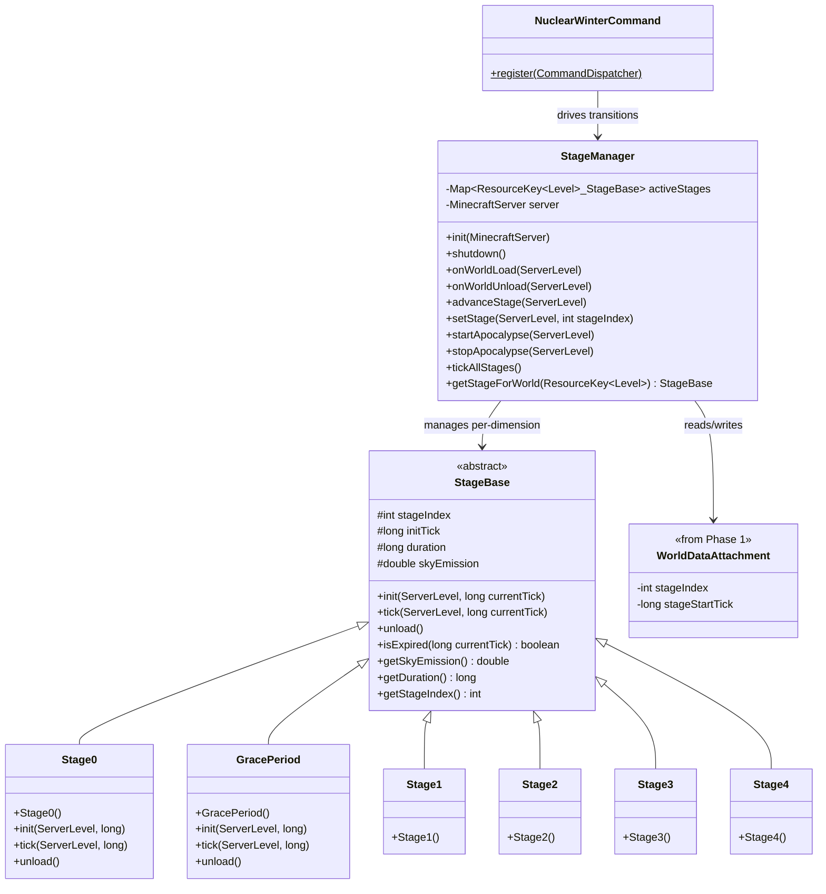

# Phase 2: Staging System — Implementation Plan

> **For Claude:** REQUIRED SUB-SKILL: Use superpowers:executing-plans to implement this plan task-by-task.

**Goal:** Implement the per-dimension staging backbone (StageManager, StageBase, Stage0-4), world data attachment integration, and admin commands for controlling the apocalypse.

**Architecture:** The `StageManager` is a singleton holding a `Map<ResourceKey<Level>, StageBase>`. It hooks into NeoForge world load/unload events to create and destroy per-dimension stage instances. Each `StageBase` subclass encapsulates one stage's behavior (duration, sky emission). The manager reads `WorldDataAttachment` on load and writes it on advancement. Admin commands (`/nuclearwinter start|stop|status|setstage`) drive transitions via the StageManager.

**Tech Stack:** NeoForge 21.1.219, Minecraft 1.21.1, Java 21, `DeferredRegister`, NeoForge Event Bus, Brigadier Commands, Data Attachments

---

## Class Diagram — What This Phase Adds



---

## Task 1: Create StageBase abstract class

**Files:**
- Create: `src/main/java/net/tomato3017/nuclearwinter/stage/StageBase.java`

**Step 1: Write StageBase**

```java
package net.tomato3017.nuclearwinter.stage;

import net.minecraft.server.level.ServerLevel;

public abstract class StageBase {
    protected final int stageIndex;
    protected long initTick;
    protected final long duration;
    protected final double skyEmission;

    protected StageBase(int stageIndex, long duration, double skyEmission) {
        this.stageIndex = stageIndex;
        this.duration = duration;
        this.skyEmission = skyEmission;
    }

    public void init(ServerLevel level, long currentTick) {
        this.initTick = currentTick;
    }

    public void tick(ServerLevel level, long currentTick) {
        // Subclasses override for stage-specific behavior
    }

    public void unload() {
        // Subclasses override for cleanup
    }

    public boolean isExpired(long currentTick) {
        if (duration <= 0) return false;
        return (currentTick - initTick) >= duration;
    }

    public int getStageIndex() { return stageIndex; }
    public long getDuration() { return duration; }
    public double getSkyEmission() { return skyEmission; }
    public long getInitTick() { return initTick; }
    public void setInitTick(long initTick) { this.initTick = initTick; }
}
```

**Step 2: Verify it compiles**

Run: `./gradlew build`
Expected: BUILD SUCCESSFUL

**Step 3: Commit**

```bash
git add -A
git commit -m "feat: add StageBase abstract class"
```

---

## Task 2: Create concrete Stage classes (Stage0, GracePeriod, Stage1-4)

**Files:**
- Create: `src/main/java/net/tomato3017/nuclearwinter/stage/Stage0.java`
- Create: `src/main/java/net/tomato3017/nuclearwinter/stage/GracePeriod.java`
- Create: `src/main/java/net/tomato3017/nuclearwinter/stage/Stage1.java`
- Create: `src/main/java/net/tomato3017/nuclearwinter/stage/Stage2.java`
- Create: `src/main/java/net/tomato3017/nuclearwinter/stage/Stage3.java`
- Create: `src/main/java/net/tomato3017/nuclearwinter/stage/Stage4.java`
- Create: `src/main/java/net/tomato3017/nuclearwinter/stage/StageFactory.java`

**Step 1: Create Stage0 (inactive placeholder)**

```java
package net.tomato3017.nuclearwinter.stage;

public class Stage0 extends StageBase {
    public static final int INDEX = 0;

    public Stage0() {
        super(INDEX, 0, 0.0);
    }
}
```

**Step 2: Create GracePeriod**

```java
package net.tomato3017.nuclearwinter.stage;

import net.tomato3017.nuclearwinter.Config;

public class GracePeriod extends StageBase {
    public static final int INDEX = 1;

    public GracePeriod() {
        super(INDEX, Config.GRACE_DURATION.get(), 0.0);
    }
}
```

**Step 3: Create Stage1**

```java
package net.tomato3017.nuclearwinter.stage;

import net.tomato3017.nuclearwinter.Config;

public class Stage1 extends StageBase {
    public static final int INDEX = 2;

    public Stage1() {
        super(INDEX, Config.STAGE1_DURATION.get(), Config.STAGE1_SKY_EMISSION.get());
    }
}
```

**Step 4: Create Stage2**

```java
package net.tomato3017.nuclearwinter.stage;

import net.tomato3017.nuclearwinter.Config;

public class Stage2 extends StageBase {
    public static final int INDEX = 3;

    public Stage2() {
        super(INDEX, Config.STAGE2_DURATION.get(), Config.STAGE2_SKY_EMISSION.get());
    }
}
```

**Step 5: Create Stage3**

```java
package net.tomato3017.nuclearwinter.stage;

import net.tomato3017.nuclearwinter.Config;

public class Stage3 extends StageBase {
    public static final int INDEX = 4;

    public Stage3() {
        super(INDEX, Config.STAGE3_DURATION.get(), Config.STAGE3_SKY_EMISSION.get());
    }
}
```

**Step 6: Create Stage4**

```java
package net.tomato3017.nuclearwinter.stage;

import net.tomato3017.nuclearwinter.Config;

public class Stage4 extends StageBase {
    public static final int INDEX = 5;

    public Stage4() {
        super(INDEX, Config.STAGE4_DURATION.get(), Config.STAGE4_SKY_EMISSION.get());
    }
}
```

**Step 7: Create StageFactory**

A factory that creates stage instances by index:

```java
package net.tomato3017.nuclearwinter.stage;

public class StageFactory {
    public static final int MAX_STAGE_INDEX = 5;

    public static StageBase create(int stageIndex) {
        return switch (stageIndex) {
            case 0 -> new Stage0();
            case 1 -> new GracePeriod();
            case 2 -> new Stage1();
            case 3 -> new Stage2();
            case 4 -> new Stage3();
            case 5 -> new Stage4();
            default -> throw new IllegalArgumentException("Unknown stage index: " + stageIndex);
        };
    }

    public static String getStageName(int stageIndex) {
        return switch (stageIndex) {
            case 0 -> "Inactive";
            case 1 -> "Grace Period";
            case 2 -> "Stage 1";
            case 3 -> "Stage 2";
            case 4 -> "Stage 3";
            case 5 -> "Stage 4";
            default -> "Unknown";
        };
    }
}
```

**Step 8: Verify it compiles**

Run: `./gradlew build`
Expected: BUILD SUCCESSFUL

**Step 9: Commit**

```bash
git add -A
git commit -m "feat: add Stage0, GracePeriod, Stage1-4, and StageFactory"
```

---

## Task 3: Create StageManager

**Files:**
- Create: `src/main/java/net/tomato3017/nuclearwinter/stage/StageManager.java`

**Step 1: Write StageManager**

```java
package net.tomato3017.nuclearwinter.stage;

import net.tomato3017.nuclearwinter.NuclearWinter;
import net.tomato3017.nuclearwinter.data.NWAttachmentTypes;
import net.tomato3017.nuclearwinter.data.WorldDataAttachment;
import net.minecraft.resources.ResourceKey;
import net.minecraft.server.MinecraftServer;
import net.minecraft.server.level.ServerLevel;
import net.minecraft.world.level.Level;

import java.util.HashMap;
import java.util.Map;

public class StageManager {
    private final Map<ResourceKey<Level>, StageBase> activeStages = new HashMap<>();
    private MinecraftServer server;

    public void init(MinecraftServer server) {
        this.server = server;
        this.activeStages.clear();
    }

    public void shutdown() {
        for (var entry : activeStages.entrySet()) {
            entry.getValue().unload();
        }
        activeStages.clear();
        server = null;
    }

    public void onWorldLoad(ServerLevel level) {
        ResourceKey<Level> dimKey = level.dimension();
        WorldDataAttachment data = level.getData(NWAttachmentTypes.WORLD_DATA);
        StageBase stage = StageFactory.create(data.stageIndex());
        stage.setInitTick(data.stageStartTick());
        activeStages.put(dimKey, stage);
        NuclearWinter.LOGGER.info("Loaded stage {} for dimension {}",
                StageFactory.getStageName(data.stageIndex()), dimKey.location());
    }

    public void onWorldUnload(ServerLevel level) {
        ResourceKey<Level> dimKey = level.dimension();
        StageBase stage = activeStages.remove(dimKey);
        if (stage != null) {
            stage.unload();
            NuclearWinter.LOGGER.info("Unloaded stage for dimension {}", dimKey.location());
        }
    }

    public void tickAllStages() {
        if (server == null) return;
        for (var entry : new HashMap<>(activeStages).entrySet()) {
            ServerLevel level = server.getLevel(entry.getKey());
            if (level == null) continue;
            StageBase stage = entry.getValue();
            long currentTick = level.getGameTime();
            stage.tick(level, currentTick);
            if (stage.isExpired(currentTick)) {
                advanceStage(level);
            }
        }
    }

    public void advanceStage(ServerLevel level) {
        ResourceKey<Level> dimKey = level.dimension();
        StageBase currentStage = activeStages.get(dimKey);
        if (currentStage == null) return;

        int nextIndex = currentStage.getStageIndex() + 1;
        if (nextIndex > StageFactory.MAX_STAGE_INDEX) return;

        currentStage.unload();
        StageBase nextStage = StageFactory.create(nextIndex);
        long currentTick = level.getGameTime();
        nextStage.init(level, currentTick);
        activeStages.put(dimKey, nextStage);

        level.setData(NWAttachmentTypes.WORLD_DATA, new WorldDataAttachment(nextIndex, currentTick));
        NuclearWinter.LOGGER.info("Dimension {} advanced to {}",
                dimKey.location(), StageFactory.getStageName(nextIndex));
    }

    public void setStage(ServerLevel level, int stageIndex) {
        ResourceKey<Level> dimKey = level.dimension();
        StageBase currentStage = activeStages.get(dimKey);
        if (currentStage != null) {
            currentStage.unload();
        }

        StageBase newStage = StageFactory.create(stageIndex);
        long currentTick = level.getGameTime();
        newStage.init(level, currentTick);
        activeStages.put(dimKey, newStage);

        level.setData(NWAttachmentTypes.WORLD_DATA, new WorldDataAttachment(stageIndex, currentTick));
        NuclearWinter.LOGGER.info("Dimension {} set to {}",
                dimKey.location(), StageFactory.getStageName(stageIndex));
    }

    public void startApocalypse(ServerLevel level) {
        ResourceKey<Level> dimKey = level.dimension();
        StageBase currentStage = activeStages.get(dimKey);
        if (currentStage != null && currentStage.getStageIndex() > 0) {
            return;
        }
        setStage(level, GracePeriod.INDEX);
    }

    public void stopApocalypse(ServerLevel level) {
        setStage(level, Stage0.INDEX);
    }

    public StageBase getStageForWorld(ResourceKey<Level> dimKey) {
        return activeStages.get(dimKey);
    }

    public Map<ResourceKey<Level>, StageBase> getAllStages() {
        return Map.copyOf(activeStages);
    }
}
```

**Step 2: Verify it compiles**

Run: `./gradlew build`
Expected: BUILD SUCCESSFUL

**Step 3: Commit**

```bash
git add -A
git commit -m "feat: add StageManager with per-dimension stage tracking"
```

---

## Task 4: Wire StageManager into NuclearWinter event handlers

**Files:**
- Modify: `src/main/java/net/tomato3017/nuclearwinter/NuclearWinter.java`

**Step 1: Add StageManager as a static field**

Add to `NuclearWinter.java`:

```java
private static StageManager stageManager;

public static StageManager getStageManager() {
    return stageManager;
}
```

**Step 2: Register event handlers**

Replace/update the `onServerStarting` and add new event handlers:

```java
@SubscribeEvent
public void onServerStarting(ServerStartingEvent event) {
    stageManager = new StageManager();
    stageManager.init(event.getServer());
    LOGGER.info("NuclearWinter StageManager initialized");
}

@SubscribeEvent
public void onServerStopping(ServerStoppingEvent event) {
    if (stageManager != null) {
        stageManager.shutdown();
        stageManager = null;
    }
}

@SubscribeEvent
public void onWorldLoad(LevelEvent.Load event) {
    if (event.getLevel() instanceof ServerLevel serverLevel) {
        if (stageManager != null) {
            stageManager.onWorldLoad(serverLevel);
        }
    }
}

@SubscribeEvent
public void onWorldUnload(LevelEvent.Unload event) {
    if (event.getLevel() instanceof ServerLevel serverLevel) {
        if (stageManager != null) {
            stageManager.onWorldUnload(serverLevel);
        }
    }
}

@SubscribeEvent
public void onServerTick(ServerTickEvent.Post event) {
    if (stageManager != null) {
        stageManager.tickAllStages();
    }
}
```

Add required imports:
```java
import net.tomato3017.nuclearwinter.stage.StageManager;
import net.minecraft.server.level.ServerLevel;
import net.neoforged.neoforge.event.server.ServerStoppingEvent;
import net.neoforged.neoforge.event.level.LevelEvent;
import net.neoforged.neoforge.event.tick.ServerTickEvent;
```

**Step 3: Verify it compiles**

Run: `./gradlew build`
Expected: BUILD SUCCESSFUL

**Step 4: Commit**

```bash
git add -A
git commit -m "feat: wire StageManager into server lifecycle events"
```

---

## Task 5: Create admin commands

**Files:**
- Create: `src/main/java/net/tomato3017/nuclearwinter/command/NuclearWinterCommand.java`
- Modify: `src/main/java/net/tomato3017/nuclearwinter/NuclearWinter.java`

**Step 1: Create the command class**

```java
package net.tomato3017.nuclearwinter.command;

import com.mojang.brigadier.CommandDispatcher;
import com.mojang.brigadier.arguments.IntegerArgumentType;
import com.mojang.brigadier.context.CommandContext;
import net.tomato3017.nuclearwinter.NuclearWinter;
import net.tomato3017.nuclearwinter.stage.StageBase;
import net.tomato3017.nuclearwinter.stage.StageFactory;
import net.tomato3017.nuclearwinter.stage.StageManager;
import net.minecraft.commands.CommandSourceStack;
import net.minecraft.commands.Commands;
import net.minecraft.commands.arguments.DimensionArgument;
import net.minecraft.network.chat.Component;
import net.minecraft.resources.ResourceKey;
import net.minecraft.server.level.ServerLevel;
import net.minecraft.world.level.Level;

import java.util.Map;

public class NuclearWinterCommand {

    public static void register(CommandDispatcher<CommandSourceStack> dispatcher) {
        dispatcher.register(Commands.literal("nuclearwinter")
                .requires(source -> source.hasPermission(2))
                .then(Commands.literal("start")
                        .then(Commands.argument("dimension", DimensionArgument.dimension())
                                .executes(NuclearWinterCommand::executeStart)))
                .then(Commands.literal("stop")
                        .then(Commands.argument("dimension", DimensionArgument.dimension())
                                .executes(NuclearWinterCommand::executeStop)))
                .then(Commands.literal("status")
                        .executes(NuclearWinterCommand::executeStatusAll)
                        .then(Commands.argument("dimension", DimensionArgument.dimension())
                                .executes(NuclearWinterCommand::executeStatusDimension)))
                .then(Commands.literal("setstage")
                        .then(Commands.argument("dimension", DimensionArgument.dimension())
                                .then(Commands.argument("stage", IntegerArgumentType.integer(0, StageFactory.MAX_STAGE_INDEX))
                                        .executes(NuclearWinterCommand::executeSetStage))))
        );
    }

    private static int executeStart(CommandContext<CommandSourceStack> ctx) throws com.mojang.brigadier.exceptions.CommandSyntaxException {
        ServerLevel level = DimensionArgument.getDimension(ctx, "dimension");
        StageManager mgr = NuclearWinter.getStageManager();
        StageBase current = mgr.getStageForWorld(level.dimension());
        if (current != null && current.getStageIndex() > 0) {
            ctx.getSource().sendFailure(Component.literal("Apocalypse already active in " + level.dimension().location()));
            return 0;
        }
        mgr.startApocalypse(level);
        ctx.getSource().sendSuccess(() -> Component.literal("Apocalypse started in " + level.dimension().location()), true);
        return 1;
    }

    private static int executeStop(CommandContext<CommandSourceStack> ctx) throws com.mojang.brigadier.exceptions.CommandSyntaxException {
        ServerLevel level = DimensionArgument.getDimension(ctx, "dimension");
        StageManager mgr = NuclearWinter.getStageManager();
        mgr.stopApocalypse(level);
        ctx.getSource().sendSuccess(() -> Component.literal("Apocalypse stopped in " + level.dimension().location()), true);
        return 1;
    }

    private static int executeStatusAll(CommandContext<CommandSourceStack> ctx) {
        StageManager mgr = NuclearWinter.getStageManager();
        Map<ResourceKey<Level>, StageBase> stages = mgr.getAllStages();
        if (stages.isEmpty()) {
            ctx.getSource().sendSuccess(() -> Component.literal("No dimensions tracked."), false);
            return 1;
        }
        for (var entry : stages.entrySet()) {
            StageBase stage = entry.getValue();
            String name = StageFactory.getStageName(stage.getStageIndex());
            ctx.getSource().sendSuccess(() -> Component.literal(
                    entry.getKey().location() + ": " + name +
                    " (sky emission: " + stage.getSkyEmission() + " Rads/sec)"
            ), false);
        }
        return 1;
    }

    private static int executeStatusDimension(CommandContext<CommandSourceStack> ctx) throws com.mojang.brigadier.exceptions.CommandSyntaxException {
        ServerLevel level = DimensionArgument.getDimension(ctx, "dimension");
        StageManager mgr = NuclearWinter.getStageManager();
        StageBase stage = mgr.getStageForWorld(level.dimension());
        if (stage == null) {
            ctx.getSource().sendFailure(Component.literal("No stage data for " + level.dimension().location()));
            return 0;
        }
        String name = StageFactory.getStageName(stage.getStageIndex());
        long elapsed = level.getGameTime() - stage.getInitTick();
        long remaining = stage.getDuration() > 0 ? stage.getDuration() - elapsed : -1;
        String remainStr = remaining >= 0 ? String.format("%.0fs", remaining / 20.0) : "indefinite";

        ctx.getSource().sendSuccess(() -> Component.literal(
                level.dimension().location() + ": " + name +
                " | Sky: " + stage.getSkyEmission() + " Rads/sec" +
                " | Time remaining: " + remainStr
        ), false);
        return 1;
    }

    private static int executeSetStage(CommandContext<CommandSourceStack> ctx) throws com.mojang.brigadier.exceptions.CommandSyntaxException {
        ServerLevel level = DimensionArgument.getDimension(ctx, "dimension");
        int stageIndex = IntegerArgumentType.getInteger(ctx, "stage");
        StageManager mgr = NuclearWinter.getStageManager();
        mgr.setStage(level, stageIndex);
        String name = StageFactory.getStageName(stageIndex);
        ctx.getSource().sendSuccess(() -> Component.literal(
                "Set " + level.dimension().location() + " to " + name
        ), true);
        return 1;
    }
}
```

**Step 2: Register commands in NuclearWinter.java**

Add a new event handler:

```java
@SubscribeEvent
public void onRegisterCommands(RegisterCommandsEvent event) {
    NuclearWinterCommand.register(event.getDispatcher());
}
```

Add imports:
```java
import net.tomato3017.nuclearwinter.command.NuclearWinterCommand;
import net.neoforged.neoforge.event.RegisterCommandsEvent;
```

**Step 3: Verify it compiles**

Run: `./gradlew build`
Expected: BUILD SUCCESSFUL

**Step 4: Commit**

```bash
git add -A
git commit -m "feat: add /nuclearwinter start|stop|status|setstage commands"
```

---

## Task 6: Write GameTests for staging

**Files:**
- Create: `src/main/java/net/tomato3017/nuclearwinter/test/StagingGameTest.java`

**Step 1: Write staging tests (for future use)**

```java
package net.tomato3017.nuclearwinter.test;

import net.tomato3017.nuclearwinter.NuclearWinter;
import net.tomato3017.nuclearwinter.data.NWAttachmentTypes;
import net.tomato3017.nuclearwinter.data.WorldDataAttachment;
import net.tomato3017.nuclearwinter.stage.GracePeriod;
import net.tomato3017.nuclearwinter.stage.Stage0;
import net.tomato3017.nuclearwinter.stage.StageBase;
import net.tomato3017.nuclearwinter.stage.StageManager;
import net.minecraft.gametest.framework.GameTest;
import net.minecraft.gametest.framework.GameTestHelper;
import net.minecraft.server.level.ServerLevel;
import net.neoforged.neoforge.gametest.GameTestHolder;
import net.neoforged.neoforge.gametest.PrefixGameTestTemplate;

@GameTestHolder("nuclearwinter")
@PrefixGameTestTemplate(false)
public class StagingGameTest {

    @GameTest(template = "empty_1x1")
    public void stageManagerStartsAtStage0(GameTestHelper helper) {
        ServerLevel level = helper.getLevel();
        StageManager mgr = NuclearWinter.getStageManager();
        StageBase stage = mgr.getStageForWorld(level.dimension());
        helper.assertTrue(stage != null, "Stage should not be null");
        helper.assertTrue(stage.getStageIndex() == Stage0.INDEX, "Should start at Stage 0");
        helper.succeed();
    }

    @GameTest(template = "empty_1x1")
    public void startApocalypseMovesToGrace(GameTestHelper helper) {
        ServerLevel level = helper.getLevel();
        StageManager mgr = NuclearWinter.getStageManager();
        mgr.startApocalypse(level);
        StageBase stage = mgr.getStageForWorld(level.dimension());
        helper.assertTrue(stage.getStageIndex() == GracePeriod.INDEX,
                "After start, should be at Grace Period");
        // Clean up
        mgr.stopApocalypse(level);
        helper.succeed();
    }

    @GameTest(template = "empty_1x1")
    public void setStageUpdatesAttachment(GameTestHelper helper) {
        ServerLevel level = helper.getLevel();
        StageManager mgr = NuclearWinter.getStageManager();
        mgr.setStage(level, 4);
        WorldDataAttachment data = level.getData(NWAttachmentTypes.WORLD_DATA);
        helper.assertTrue(data.stageIndex() == 4, "Attachment should reflect stage 4");
        // Clean up
        mgr.setStage(level, 0);
        helper.succeed();
    }
}
```

> **Note:** GameTest execution is skipped for now (no test structure template available). The test class is written for future use. Verify correctness via `./gradlew build` and manual testing.

**Step 2: Verify it compiles**

Run: `./gradlew build`
Expected: BUILD SUCCESSFUL

**Step 3: Commit**

```bash
git add -A
git commit -m "test: add GameTests for staging system"
```

---

## Manual Testing Checklist

After completing all tasks above, perform these manual tests:

1. **Server starts with Stage 0:** Run `./gradlew runServer`. Check logs for `"Loaded stage Inactive for dimension minecraft:overworld"`. Run `/nuclearwinter status` — should show all dimensions at "Inactive".

2. **Start command works:** Run `/nuclearwinter start minecraft:overworld`. Output should confirm "Apocalypse started". Run `/nuclearwinter status minecraft:overworld` — should show "Grace Period" with a time remaining.

3. **Status shows time remaining:** Wait ~10 seconds. Run `/nuclearwinter status minecraft:overworld` again. Time remaining should have decreased.

4. **SetStage command works:** Run `/nuclearwinter setstage minecraft:overworld 4`. Status should show "Stage 3" (stage index 4 = Stage 3 in the design). Sky emission should be 333 Rads/sec.

5. **Stop command works:** Run `/nuclearwinter stop minecraft:overworld`. Status should show "Inactive".

6. **Persistence across restart:** Run `/nuclearwinter start minecraft:overworld`, then `/nuclearwinter setstage minecraft:overworld 3`. Stop the server. Start it again. Run `/nuclearwinter status` — overworld should still be at Stage 2 (index 3).

7. **Stage advancement:** Set `graceDuration = 100` in the config (5 seconds). Start the apocalypse. Wait 5+ seconds. Run `/nuclearwinter status` — should have automatically advanced from Grace Period to Stage 1.

8. **Per-dimension independence:** If Nether is loaded, verify `/nuclearwinter start minecraft:the_nether` starts only the Nether. Overworld should remain at whatever stage it was at.

9. **`stages` subcommand lists all stages:** Run `/nuclearwinter stages`. Output should show one line per stage — all six entries (`INACTIVE` through `STAGE_4`) with their integer index and display name. No dimension argument required.

10. **`setstage` accepts a stage name:** Run `/nuclearwinter setstage minecraft:overworld GRACE_PERIOD`. Status should show "Grace Period" as if `/nuclearwinter setstage minecraft:overworld 1` had been used. Run `/nuclearwinter stop minecraft:overworld` to reset.

11. **`setstage` name matching is case-insensitive:** Run `/nuclearwinter setstage minecraft:overworld grace_period` (lowercase). Should work identically to the uppercase form. Run `/nuclearwinter stop minecraft:overworld` to reset.

12. **`setstage` tab-completion offers stage names:** In-game, type `/nuclearwinter setstage minecraft:overworld ` and press Tab. The completion list should include `INACTIVE`, `GRACE_PERIOD`, `STAGE_1`, `STAGE_2`, `STAGE_3`, `STAGE_4`.

13. **`setstage` rejects an invalid name:** Run `/nuclearwinter setstage minecraft:overworld STAGE_99`. Should return a failure message (red text) rather than an exception or silent no-op.
