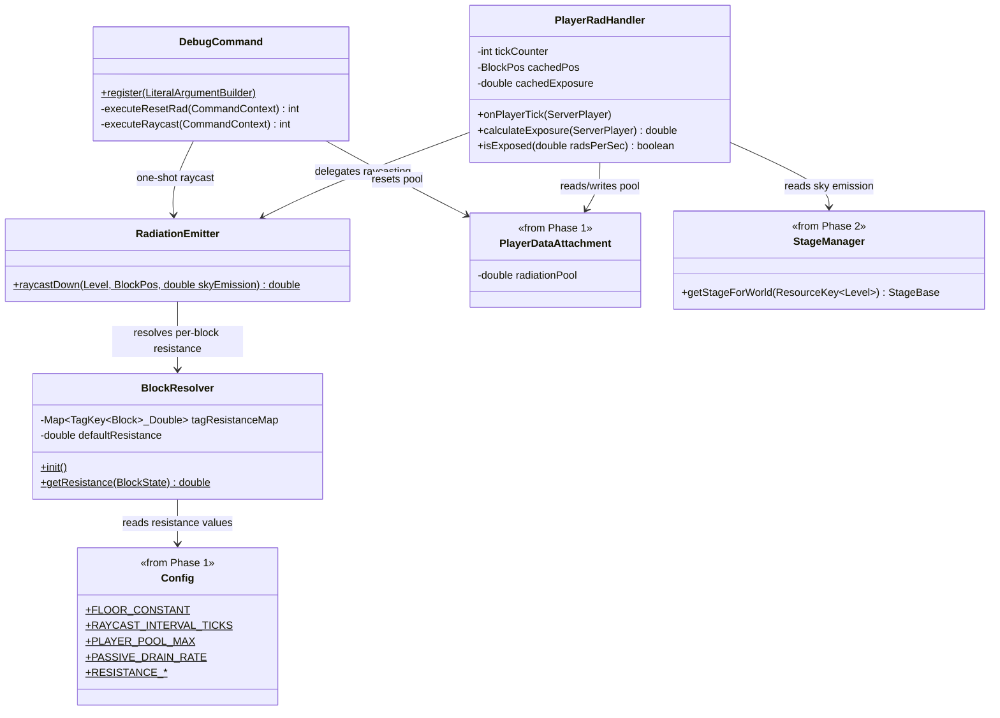

# Phase 3: Radiation Core — Implementation Plan

> **For Claude:** REQUIRED SUB-SKILL: Use superpowers:executing-plans to implement this plan task-by-task.

**Goal:** Implement the radiation raycast (sky to player/block), block resistance resolution, the player radiation pool (accumulation + passive drain), and debug commands for testing radiation math in-game.

**Architecture:** `BlockResolver` maps block tags and individual blocks to resistance values, initialized from `Config`. `RadiationEmitter` performs the downward raycast applying `currentRad * 0.5 * (1/resistance)` per block, exiting early below the floor constant. `PlayerRadHandler` runs on a tick interval per player, calls `RadiationEmitter`, accumulates into the player's `PlayerDataAttachment` pool, and drains passively when unexposed. Two debug subcommands are added under `/nuclearwinter debug` for resetting radiation and running one-shot raycasts.

**Tech Stack:** NeoForge 21.1.219, Minecraft 1.21.1, Java 21, Block Tags, `PlayerTickEvent`, Data Attachments, Brigadier Commands

---

## Class Diagram — What This Phase Adds



---

## Task 1: Create BlockResolver

**Files:**
- Create: `src/main/java/net/tomato3017/nuclearwinter/radiation/BlockResolver.java`

**Step 1: Write BlockResolver**

```java
package net.tomato3017.nuclearwinter.radiation;

import net.tomato3017.nuclearwinter.Config;
import net.tomato3017.nuclearwinter.NuclearWinter;
import net.minecraft.tags.BlockTags;
import net.minecraft.tags.TagKey;
import net.minecraft.world.level.block.Block;
import net.minecraft.world.level.block.Blocks;
import net.minecraft.world.level.block.state.BlockState;
import net.neoforged.neoforge.common.Tags;

import java.util.LinkedHashMap;
import java.util.Map;

public class BlockResolver {
    private static final Map<TagKey<Block>, Double> TAG_RESISTANCE_MAP = new LinkedHashMap<>();
    private static final Map<Block, Double> BLOCK_OVERRIDES = new LinkedHashMap<>();
    private static double defaultResistance = 1.0;

    public static void init() {
        TAG_RESISTANCE_MAP.clear();
        BLOCK_OVERRIDES.clear();

        defaultResistance = Config.RESISTANCE_STONE.get();

        TAG_RESISTANCE_MAP.put(BlockTags.DIRT, Config.RESISTANCE_DIRT.get());
        TAG_RESISTANCE_MAP.put(BlockTags.LOGS, Config.RESISTANCE_WOOD.get());
        TAG_RESISTANCE_MAP.put(BlockTags.PLANKS, Config.RESISTANCE_WOOD.get());
        TAG_RESISTANCE_MAP.put(BlockTags.WOODEN_FENCES, Config.RESISTANCE_WOOD.get());
        TAG_RESISTANCE_MAP.put(BlockTags.WOODEN_DOORS, Config.RESISTANCE_WOOD.get());
        TAG_RESISTANCE_MAP.put(BlockTags.WOODEN_SLABS, Config.RESISTANCE_WOOD.get());
        TAG_RESISTANCE_MAP.put(BlockTags.WOODEN_STAIRS, Config.RESISTANCE_WOOD.get());
        TAG_RESISTANCE_MAP.put(BlockTags.STONE_ORE_REPLACEABLES, Config.RESISTANCE_STONE.get());
        TAG_RESISTANCE_MAP.put(BlockTags.DEEPSLATE_ORE_REPLACEABLES, Config.RESISTANCE_DEEPSLATE.get());

        BLOCK_OVERRIDES.put(Blocks.OBSIDIAN, Config.RESISTANCE_DEEPSLATE.get());
        BLOCK_OVERRIDES.put(Blocks.CRYING_OBSIDIAN, Config.RESISTANCE_DEEPSLATE.get());
        BLOCK_OVERRIDES.put(Blocks.IRON_BLOCK, Config.RESISTANCE_IRON.get());
        BLOCK_OVERRIDES.put(Blocks.WATER, Config.RESISTANCE_WATER.get());
        BLOCK_OVERRIDES.put(Blocks.GRAVEL, Config.RESISTANCE_DIRT.get());

        NuclearWinter.LOGGER.info("BlockResolver initialized with {} tag entries and {} block overrides",
                TAG_RESISTANCE_MAP.size(), BLOCK_OVERRIDES.size());
    }

    public static void registerBlockOverride(Block block, double resistance) {
        BLOCK_OVERRIDES.put(block, resistance);
    }

    public static double getResistance(BlockState state) {
        Block block = state.getBlock();

        if (state.isAir()) return 0.0;

        Double override = BLOCK_OVERRIDES.get(block);
        if (override != null) return override;

        for (var entry : TAG_RESISTANCE_MAP.entrySet()) {
            if (state.is(entry.getKey())) {
                return entry.getValue();
            }
        }

        return defaultResistance;
    }
}
```

**Step 2: Initialize BlockResolver on server start**

In `NuclearWinter.java`, add to the `onServerStarting` method (after StageManager init):

```java
BlockResolver.init();
```

Also register custom block overrides for the Phase 1 blocks after `init()`:

```java
BlockResolver.registerBlockOverride(NWBlocks.LEAD_BLOCK.get(), Config.RESISTANCE_LEAD.get());
BlockResolver.registerBlockOverride(NWBlocks.REINFORCED_CONCRETE.get(), Config.RESISTANCE_REINFORCED_CONCRETE.get());
```

Add imports:
```java
import net.tomato3017.nuclearwinter.radiation.BlockResolver;
```

**Step 3: Verify it compiles**

Run: `./gradlew build`
Expected: BUILD SUCCESSFUL

**Step 4: Commit**

```bash
git add -A
git commit -m "feat: add BlockResolver with tag-based resistance lookups"
```

---

## Task 2: Create RadiationEmitter

**Files:**
- Create: `src/main/java/net/tomato3017/nuclearwinter/radiation/RadiationEmitter.java`

**Step 1: Write RadiationEmitter**

```java
package net.tomato3017.nuclearwinter.radiation;

import net.tomato3017.nuclearwinter.Config;
import net.minecraft.core.BlockPos;
import net.minecraft.world.level.Level;
import net.minecraft.world.level.block.state.BlockState;

public class RadiationEmitter {

    public static double raycastDown(Level level, BlockPos playerPos, double skyEmission) {
        if (skyEmission <= 0) return 0.0;

        double floorConstant = Config.FLOOR_CONSTANT.get();
        double currentRad = skyEmission;
        int topY = level.getMaxBuildHeight();
        int playerY = playerPos.getY();

        BlockPos.MutableBlockPos mutablePos = new BlockPos.MutableBlockPos(
                playerPos.getX(), topY, playerPos.getZ());

        for (int y = topY - 1; y >= playerY; y--) {
            mutablePos.setY(y);
            BlockState state = level.getBlockState(mutablePos);

            if (state.isAir()) continue;

            double resistance = BlockResolver.getResistance(state);
            if (resistance <= 0) continue;

            currentRad = currentRad * 0.5 * (1.0 / resistance);

            if (currentRad < floorConstant) {
                return 0.0;
            }
        }

        return currentRad;
    }
}
```

**Step 2: Verify it compiles**

Run: `./gradlew build`
Expected: BUILD SUCCESSFUL

**Step 3: Commit**

```bash
git add -A
git commit -m "feat: add RadiationEmitter with sky-to-player raycast"
```

---

## Task 3: Create PlayerRadHandler

**Files:**
- Create: `src/main/java/net/tomato3017/nuclearwinter/radiation/PlayerRadHandler.java`
- Modify: `src/main/java/net/tomato3017/nuclearwinter/NuclearWinter.java`

**Step 1: Write PlayerRadHandler**

```java
package net.tomato3017.nuclearwinter.radiation;

import net.tomato3017.nuclearwinter.Config;
import net.tomato3017.nuclearwinter.NuclearWinter;
import net.tomato3017.nuclearwinter.data.NWAttachmentTypes;
import net.tomato3017.nuclearwinter.data.PlayerDataAttachment;
import net.tomato3017.nuclearwinter.stage.StageBase;
import net.minecraft.core.BlockPos;
import net.minecraft.server.level.ServerPlayer;

import java.util.HashMap;
import java.util.Map;
import java.util.UUID;

public class PlayerRadHandler {
    private static final Map<UUID, CachedExposure> cache = new HashMap<>();

    private record CachedExposure(BlockPos pos, double radsPerSec, long tick) {}

    public static void onPlayerTick(ServerPlayer player) {
        int interval = Config.RAYCAST_INTERVAL_TICKS.get();
        long currentTick = player.level().getGameTime();

        if (currentTick % interval != 0) return;

        StageBase stage = NuclearWinter.getStageManager()
                .getStageForWorld(player.level().dimension());
        if (stage == null || stage.getSkyEmission() <= 0) {
            drainIfUnexposed(player, currentTick, interval);
            return;
        }

        double skyEmission = stage.getSkyEmission();
        double radsPerSec = getExposure(player, skyEmission, currentTick);
        double radsThisTick = radsPerSec * (interval / 20.0);

        PlayerDataAttachment data = player.getData(NWAttachmentTypes.PLAYER_DATA);
        double pool = data.radiationPool();
        double poolMax = Config.PLAYER_POOL_MAX.get();

        if (radsPerSec > 0) {
            pool = Math.min(pool + radsThisTick, poolMax);
        } else {
            double drainAmount = Config.PASSIVE_DRAIN_RATE.get() * (interval / 20.0);
            pool = Math.max(pool - drainAmount, 0.0);
        }

        player.setData(NWAttachmentTypes.PLAYER_DATA, data.withRadiationPool(pool));
    }

    private static double getExposure(ServerPlayer player, double skyEmission, long currentTick) {
        UUID uuid = player.getUUID();
        BlockPos currentPos = player.blockPosition();
        CachedExposure cached = cache.get(uuid);

        if (cached != null && cached.pos.equals(currentPos) && cached.tick == currentTick) {
            return cached.radsPerSec;
        }

        double radsPerSec = RadiationEmitter.raycastDown(player.level(), currentPos, skyEmission);
        cache.put(uuid, new CachedExposure(currentPos, radsPerSec, currentTick));
        return radsPerSec;
    }

    private static void drainIfUnexposed(ServerPlayer player, long currentTick, int interval) {
        PlayerDataAttachment data = player.getData(NWAttachmentTypes.PLAYER_DATA);
        double pool = data.radiationPool();
        if (pool > 0) {
            double drainAmount = Config.PASSIVE_DRAIN_RATE.get() * (interval / 20.0);
            pool = Math.max(pool - drainAmount, 0.0);
            player.setData(NWAttachmentTypes.PLAYER_DATA, data.withRadiationPool(pool));
        }
    }

    public static void clearCache(UUID playerId) {
        cache.remove(playerId);
    }

    public static void clearAllCaches() {
        cache.clear();
    }
}
```

**Step 2: Wire into player tick event**

Add to `NuclearWinter.java`:

```java
@SubscribeEvent
public void onPlayerTick(PlayerTickEvent.Post event) {
    if (event.getEntity() instanceof ServerPlayer serverPlayer) {
        PlayerRadHandler.onPlayerTick(serverPlayer);
    }
}
```

Add imports:
```java
import net.tomato3017.nuclearwinter.radiation.PlayerRadHandler;
import net.minecraft.server.level.ServerPlayer;
import net.neoforged.neoforge.event.tick.PlayerTickEvent;
```

**Step 3: Verify it compiles**

Run: `./gradlew build`
Expected: BUILD SUCCESSFUL

**Step 4: Commit**

```bash
git add -A
git commit -m "feat: add PlayerRadHandler with pool accumulation and drain"
```

---

## Task 4: Add debug commands

**Files:**
- Create: `src/main/java/net/tomato3017/nuclearwinter/command/DebugCommand.java`
- Modify: `src/main/java/net/tomato3017/nuclearwinter/command/NuclearWinterCommand.java`

**Step 1: Create DebugCommand**

```java
package net.tomato3017.nuclearwinter.command;

import com.mojang.brigadier.builder.LiteralArgumentBuilder;
import com.mojang.brigadier.context.CommandContext;
import net.tomato3017.nuclearwinter.NuclearWinter;
import net.tomato3017.nuclearwinter.data.NWAttachmentTypes;
import net.tomato3017.nuclearwinter.data.PlayerDataAttachment;
import net.tomato3017.nuclearwinter.radiation.RadiationEmitter;
import net.tomato3017.nuclearwinter.stage.StageBase;
import net.minecraft.commands.CommandSourceStack;
import net.minecraft.commands.Commands;
import net.minecraft.commands.arguments.EntityArgument;
import net.minecraft.network.chat.Component;
import net.minecraft.server.level.ServerPlayer;

public class DebugCommand {

    public static LiteralArgumentBuilder<CommandSourceStack> register() {
        return Commands.literal("debug")
                .then(Commands.literal("resetrad")
                        .executes(ctx -> executeResetRad(ctx, ctx.getSource().getPlayerOrException()))
                        .then(Commands.argument("player", EntityArgument.player())
                                .executes(ctx -> executeResetRad(ctx, EntityArgument.getPlayer(ctx, "player")))))
                .then(Commands.literal("raycast")
                        .executes(DebugCommand::executeRaycast));
    }

    private static int executeResetRad(CommandContext<CommandSourceStack> ctx, ServerPlayer target) {
        target.setData(NWAttachmentTypes.PLAYER_DATA, PlayerDataAttachment.DEFAULT);
        ctx.getSource().sendSuccess(() -> Component.literal(
                "Reset radiation pool for " + target.getName().getString() + " to 0"
        ), true);
        return 1;
    }

    private static int executeRaycast(CommandContext<CommandSourceStack> ctx) throws com.mojang.brigadier.exceptions.CommandSyntaxException {
        ServerPlayer player = ctx.getSource().getPlayerOrException();
        StageBase stage = NuclearWinter.getStageManager()
                .getStageForWorld(player.level().dimension());

        if (stage == null || stage.getSkyEmission() <= 0) {
            ctx.getSource().sendSuccess(() -> Component.literal(
                    "No active radiation (stage inactive or sky emission = 0)"
            ), false);
            return 1;
        }

        double skyEmission = stage.getSkyEmission();
        double radsPerSec = RadiationEmitter.raycastDown(player.level(), player.blockPosition(), skyEmission);
        PlayerDataAttachment data = player.getData(NWAttachmentTypes.PLAYER_DATA);
        double poolPercent = (data.radiationPool() / net.tomato3017.nuclearwinter.Config.PLAYER_POOL_MAX.get()) * 100.0;

        ctx.getSource().sendSuccess(() -> Component.literal(String.format(
                "Raycast result: %.2f Rads/sec (sky emission: %.0f, pool: %.0f / %.0f%% full)",
                radsPerSec, skyEmission, data.radiationPool(), poolPercent
        )), false);
        return 1;
    }
}
```

**Step 2: Register debug subcommand**

In `NuclearWinterCommand.register()`, add the debug subtree to the main command:

```java
dispatcher.register(Commands.literal("nuclearwinter")
        .requires(source -> source.hasPermission(2))
        .then(Commands.literal("start") /* ... existing ... */)
        .then(Commands.literal("stop") /* ... existing ... */)
        .then(Commands.literal("status") /* ... existing ... */)
        .then(Commands.literal("setstage") /* ... existing ... */)
        .then(DebugCommand.register())
);
```

Specifically, add `.then(DebugCommand.register())` to the chain before the closing `);`.

**Step 3: Verify it compiles**

Run: `./gradlew build`
Expected: BUILD SUCCESSFUL

**Step 4: Commit**

```bash
git add -A
git commit -m "feat: add /nuclearwinter debug resetrad and raycast commands"
```

---

## Task 5: Write GameTests for radiation

**Files:**
- Create: `src/main/java/net/tomato3017/nuclearwinter/test/RadiationGameTest.java`

**Step 1: Write radiation tests (for future use)**

```java
package net.tomato3017.nuclearwinter.test;

import net.tomato3017.nuclearwinter.radiation.BlockResolver;
import net.tomato3017.nuclearwinter.radiation.RadiationEmitter;
import net.minecraft.core.BlockPos;
import net.minecraft.gametest.framework.GameTest;
import net.minecraft.gametest.framework.GameTestHelper;
import net.minecraft.world.level.block.Blocks;
import net.neoforged.neoforge.gametest.GameTestHolder;
import net.neoforged.neoforge.gametest.PrefixGameTestTemplate;

@GameTestHolder("nuclearwinter")
@PrefixGameTestTemplate(false)
public class RadiationGameTest {

    @GameTest(template = "empty_1x1")
    public void stoneResistanceIsBaseline(GameTestHelper helper) {
        double resistance = BlockResolver.getResistance(Blocks.STONE.defaultBlockState());
        helper.assertTrue(Math.abs(resistance - 1.0) < 0.001,
                "Stone resistance should be 1.0, got " + resistance);
        helper.succeed();
    }

    @GameTest(template = "empty_1x1")
    public void airResistanceIsZero(GameTestHelper helper) {
        double resistance = BlockResolver.getResistance(Blocks.AIR.defaultBlockState());
        helper.assertTrue(resistance == 0.0,
                "Air resistance should be 0.0, got " + resistance);
        helper.succeed();
    }

    @GameTest(template = "empty_1x1")
    public void raycastOpenSkyReturnsSkyEmission(GameTestHelper helper) {
        BlockPos pos = helper.absolutePos(new BlockPos(0, 1, 0));
        double result = RadiationEmitter.raycastDown(helper.getLevel(), pos, 333.0);
        helper.assertTrue(result > 300.0,
                "Open sky raycast should return near sky emission, got " + result);
        helper.succeed();
    }
}
```

> **Note:** GameTest execution is skipped for now (no test structure template available). The test class is written for future use. Verify correctness via `./gradlew build` and manual testing.

**Step 2: Verify it compiles**

Run: `./gradlew build`
Expected: BUILD SUCCESSFUL

**Step 3: Commit**

```bash
git add -A
git commit -m "test: add GameTests for BlockResolver and RadiationEmitter"
```

---

## Manual Testing Checklist

After completing all tasks above, perform these manual tests:

1. **BlockResolver initialization:** Start the server. Check logs for `"BlockResolver initialized with X tag entries and Y block overrides"`.

2. **Debug raycast — open sky:** Run `/nuclearwinter start minecraft:overworld`, then `/nuclearwinter setstage minecraft:overworld 4` (Stage 3, sky emission 333). Stand in open sky. Run `/nuclearwinter debug raycast`. Expected output: approximately 333 Rads/sec.

3. **Debug raycast — underground:** Dig down or teleport below 10+ stone blocks. Run `/nuclearwinter debug raycast`. Expected: 0.0 Rads/sec (below floor constant).

4. **Debug raycast — partial shelter:** Stand under exactly 3 stone blocks with open sky above those. Run `/nuclearwinter debug raycast`. Expected: a value between 0 and 333 (each stone halves radiation: 333 * 0.5^3 = ~41.6 Rads/sec).

5. **Pool accumulation:** Stand in open sky at Stage 3. Wait 30 seconds. Run `/nuclearwinter debug raycast` — the pool percentage should have increased from 0%.

6. **Pool drain:** Run `/nuclearwinter debug resetrad` to confirm pool resets. Stand in open sky briefly, then go underground. Run `/nuclearwinter debug raycast` every few seconds — pool should decrease.

7. **Debug resetrad on another player:** If in multiplayer, run `/nuclearwinter debug resetrad <playername>` — target player's pool should reset.

8. **Lead block shielding:** Place 2 lead blocks above your head. Run `/nuclearwinter debug raycast`. Expected: much lower than 2 stone blocks would give (lead resistance 16.0 vs stone 1.0). Two lead blocks: 333 * (0.5/16)^2 = ~0.065 Rads/sec ≈ 0 (below floor).

9. **Config reload:** Change `floorConstant` in the config file to 10. Reload the server (or use `/nuclearwinter debug raycast` after server restart). The raycast should now show non-zero values for thinner shelters.
