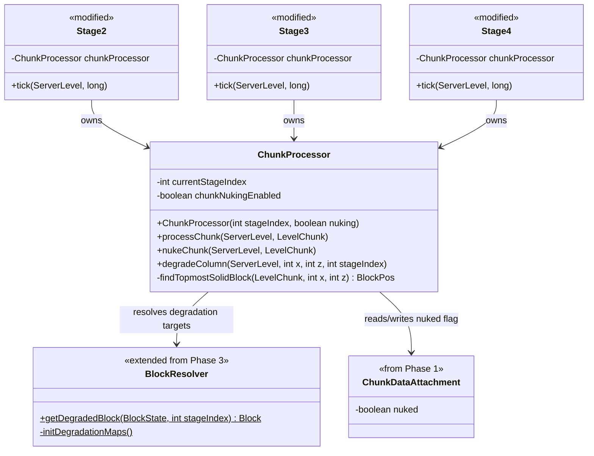

# Phase 4: Block Degradation & Chunk Processing — Implementation Plan

> **For Claude:** REQUIRED SUB-SKILL: Use superpowers:executing-plans to implement this plan task-by-task.

**Goal:** Make the world visually deteriorate as stages advance. Surface blocks degrade based on their category (grass, dirt, stone, log, leaf, plank) at Stage 2 and Stage 4. A chunk nuking routine at Stage 4 processes every column in a chunk and marks it as nuked via `ChunkDataAttachment`.

**Architecture:** `ChunkProcessor` is a helper class owned by Stage2-4. It processes loaded chunks on a tick schedule, casting a ray per column to find the topmost solid block and applying degradation mappings from `BlockResolver`. For Stage 4 chunk nuking, every column in the chunk is processed in a single pass and the chunk is flagged via `ChunkDataAttachment`. The `BlockResolver` from Phase 3 is extended with degradation mapping methods.

**Tech Stack:** NeoForge 21.1.219, Minecraft 1.21.1, Java 21, Block Tags, `LevelChunk`, Data Attachments, `ChunkEvent`

---

## Class Diagram — What This Phase Adds



---

## Task 1: Add degradation mappings to BlockResolver

**Files:**
- Modify: `src/main/java/net/tomato3017/nuclearwinter/radiation/BlockResolver.java`

**Step 1: Write GameTest class (for future use)**

**Files:**
- Create: `src/main/java/net/tomato3017/nuclearwinter/test/DegradationGameTest.java`

```java
package net.tomato3017.nuclearwinter.test;

import net.tomato3017.nuclearwinter.radiation.BlockResolver;
import net.minecraft.gametest.framework.GameTest;
import net.minecraft.gametest.framework.GameTestHelper;
import net.minecraft.world.level.block.Block;
import net.minecraft.world.level.block.Blocks;
import net.neoforged.neoforge.gametest.GameTestHolder;
import net.neoforged.neoforge.gametest.PrefixGameTestTemplate;

@GameTestHolder("nuclearwinter")
@PrefixGameTestTemplate(false)
public class DegradationGameTest {

    @GameTest(template = "empty_1x1")
    public void grassDegradesToDeadGrassAtStage2(GameTestHelper helper) {
        Block result = BlockResolver.getDegradedBlock(Blocks.GRASS_BLOCK.defaultBlockState(), 3);
        helper.assertTrue(result != null, "Grass should degrade at stage index 3 (Stage 2)");
        helper.succeed();
    }

    @GameTest(template = "empty_1x1")
    public void stoneDoesNotDegradeAtStage1(GameTestHelper helper) {
        Block result = BlockResolver.getDegradedBlock(Blocks.STONE.defaultBlockState(), 2);
        helper.assertTrue(result == null, "Stone should not degrade at stage index 2 (Stage 1)");
        helper.succeed();
    }
}
```

> **Note:** GameTest execution is skipped for now (no test structure template available). The test class is written for future use. Verify correctness via `./gradlew build` and manual testing.

**Step 2: Add degradation maps and method to BlockResolver**

Add the following fields and methods to `BlockResolver.java`:

```java
// Degradation maps: tag -> output block at each tier
private static final Map<TagKey<Block>, Block> STAGE2_TAG_DEGRADATION = new LinkedHashMap<>();
private static final Map<TagKey<Block>, Block> STAGE4_TAG_DEGRADATION = new LinkedHashMap<>();
private static final Map<Block, Block> STAGE2_BLOCK_DEGRADATION = new LinkedHashMap<>();
private static final Map<Block, Block> STAGE4_BLOCK_DEGRADATION = new LinkedHashMap<>();
```

Add a new method `initDegradationMaps()` called at the end of `init()`:

```java
private static void initDegradationMaps() {
    STAGE2_TAG_DEGRADATION.clear();
    STAGE4_TAG_DEGRADATION.clear();
    STAGE2_BLOCK_DEGRADATION.clear();
    STAGE4_BLOCK_DEGRADATION.clear();

    // Grass-type -> Dead Grass (Stage 2) -> Wasteland Dust (Stage 4)
    STAGE2_BLOCK_DEGRADATION.put(Blocks.GRASS_BLOCK, NWBlocks.DEAD_GRASS.get());
    STAGE2_BLOCK_DEGRADATION.put(Blocks.MYCELIUM, NWBlocks.DEAD_GRASS.get());
    STAGE2_BLOCK_DEGRADATION.put(Blocks.PODZOL, NWBlocks.DEAD_GRASS.get());
    STAGE4_BLOCK_DEGRADATION.put(Blocks.GRASS_BLOCK, NWBlocks.WASTELAND_DUST.get());
    STAGE4_BLOCK_DEGRADATION.put(Blocks.MYCELIUM, NWBlocks.WASTELAND_DUST.get());
    STAGE4_BLOCK_DEGRADATION.put(Blocks.PODZOL, NWBlocks.WASTELAND_DUST.get());
    STAGE4_BLOCK_DEGRADATION.put(NWBlocks.DEAD_GRASS.get(), NWBlocks.WASTELAND_DUST.get());

    // Dirt-type -> Parched Dirt (Stage 2) -> Wasteland Dust (Stage 4)
    STAGE2_TAG_DEGRADATION.put(BlockTags.DIRT, NWBlocks.PARCHED_DIRT.get());
    STAGE4_TAG_DEGRADATION.put(BlockTags.DIRT, NWBlocks.WASTELAND_DUST.get());
    STAGE4_BLOCK_DEGRADATION.put(NWBlocks.PARCHED_DIRT.get(), NWBlocks.WASTELAND_DUST.get());

    // Stone-type -> Cracked Stone (Stage 2) -> Wasteland Rubble (Stage 4)
    STAGE2_BLOCK_DEGRADATION.put(Blocks.STONE, NWBlocks.CRACKED_STONE.get());
    STAGE2_BLOCK_DEGRADATION.put(Blocks.COBBLESTONE, NWBlocks.CRACKED_STONE.get());
    STAGE2_BLOCK_DEGRADATION.put(Blocks.ANDESITE, NWBlocks.CRACKED_STONE.get());
    STAGE2_BLOCK_DEGRADATION.put(Blocks.GRANITE, NWBlocks.CRACKED_STONE.get());
    STAGE2_BLOCK_DEGRADATION.put(Blocks.DIORITE, NWBlocks.CRACKED_STONE.get());
    STAGE4_BLOCK_DEGRADATION.put(Blocks.STONE, NWBlocks.WASTELAND_RUBBLE.get());
    STAGE4_BLOCK_DEGRADATION.put(Blocks.COBBLESTONE, NWBlocks.WASTELAND_RUBBLE.get());
    STAGE4_BLOCK_DEGRADATION.put(Blocks.ANDESITE, NWBlocks.WASTELAND_RUBBLE.get());
    STAGE4_BLOCK_DEGRADATION.put(Blocks.GRANITE, NWBlocks.WASTELAND_RUBBLE.get());
    STAGE4_BLOCK_DEGRADATION.put(Blocks.DIORITE, NWBlocks.WASTELAND_RUBBLE.get());
    STAGE4_BLOCK_DEGRADATION.put(NWBlocks.CRACKED_STONE.get(), NWBlocks.WASTELAND_RUBBLE.get());

    // Log-type -> Deadwood (Stage 2), no further degradation
    STAGE2_TAG_DEGRADATION.put(BlockTags.LOGS, NWBlocks.DEADWOOD.get());

    // Leaf-type -> Dead Leaves (Stage 2) -> Air (Stage 4)
    STAGE2_TAG_DEGRADATION.put(BlockTags.LEAVES, NWBlocks.DEAD_LEAVES.get());
    STAGE4_TAG_DEGRADATION.put(BlockTags.LEAVES, Blocks.AIR);
    STAGE4_BLOCK_DEGRADATION.put(NWBlocks.DEAD_LEAVES.get(), Blocks.AIR);

    // Plank-type -> Ruined Planks (Stage 2), no further degradation
    STAGE2_TAG_DEGRADATION.put(BlockTags.PLANKS, NWBlocks.RUINED_PLANKS.get());
}
```

Add the public lookup method:

```java
/**
 * Returns the block that the given state should degrade into at the given stage index,
 * or null if no degradation applies.
 * Stage index 3 = Stage 2 (first degradation tier), stage index 5 = Stage 4 (second tier).
 */
public static Block getDegradedBlock(BlockState state, int stageIndex) {
    Block block = state.getBlock();

    // Determine which maps to use based on stage index
    Map<Block, Block> blockMap;
    Map<TagKey<Block>, Block> tagMap;
    if (stageIndex >= 5) {
        blockMap = STAGE4_BLOCK_DEGRADATION;
        tagMap = STAGE4_TAG_DEGRADATION;
    } else if (stageIndex >= 3) {
        blockMap = STAGE2_BLOCK_DEGRADATION;
        tagMap = STAGE2_TAG_DEGRADATION;
    } else {
        return null;
    }

    // Check block-specific overrides first
    Block result = blockMap.get(block);
    if (result != null) return result;

    // Check tag-based mappings
    for (var entry : tagMap.entrySet()) {
        if (state.is(entry.getKey())) {
            return entry.getValue();
        }
    }

    return null;
}
```

Add the import for `NWBlocks`:
```java
import net.tomato3017.nuclearwinter.block.NWBlocks;
```

Call `initDegradationMaps()` at the end of the existing `init()` method.

**Step 3: Verify it compiles**

Run: `./gradlew build`
Expected: BUILD SUCCESSFUL

**Step 4: Commit**

```bash
git add -A
git commit -m "feat: add block degradation mappings to BlockResolver"
```

---

## Task 2: Create ChunkProcessor

**Files:**
- Create: `src/main/java/net/tomato3017/nuclearwinter/chunk/ChunkProcessor.java`

**Step 1: Write ChunkProcessor**

```java
package net.tomato3017.nuclearwinter.chunk;

import net.tomato3017.nuclearwinter.NuclearWinter;
import net.tomato3017.nuclearwinter.data.ChunkDataAttachment;
import net.tomato3017.nuclearwinter.data.NWAttachmentTypes;
import net.tomato3017.nuclearwinter.radiation.BlockResolver;
import net.minecraft.core.BlockPos;
import net.minecraft.server.level.ServerLevel;
import net.minecraft.world.level.block.Block;
import net.minecraft.world.level.block.state.BlockState;
import net.minecraft.world.level.chunk.LevelChunk;

public class ChunkProcessor {
    private final int stageIndex;
    private final boolean chunkNukingEnabled;
    private static final int COLUMNS_PER_TICK = 16;

    public ChunkProcessor(int stageIndex, boolean chunkNukingEnabled) {
        this.stageIndex = stageIndex;
        this.chunkNukingEnabled = chunkNukingEnabled;
    }

    public void processChunk(ServerLevel level, LevelChunk chunk) {
        if (chunkNukingEnabled) {
            ChunkDataAttachment data = chunk.getData(NWAttachmentTypes.CHUNK_DATA);
            if (!data.nuked()) {
                nukeChunk(level, chunk);
                return;
            }
        }
        degradeRandomColumns(level, chunk);
    }

    public void nukeChunk(ServerLevel level, LevelChunk chunk) {
        int startX = chunk.getPos().getMinBlockX();
        int startZ = chunk.getPos().getMinBlockZ();

        for (int dx = 0; dx < 16; dx++) {
            for (int dz = 0; dz < 16; dz++) {
                degradeColumn(level, startX + dx, startZ + dz);
            }
        }

        chunk.setData(NWAttachmentTypes.CHUNK_DATA, new ChunkDataAttachment(true));
        chunk.setUnsaved(true);
        NuclearWinter.LOGGER.debug("Nuked chunk at [{}, {}]", chunk.getPos().x, chunk.getPos().z);
    }

    private void degradeRandomColumns(ServerLevel level, LevelChunk chunk) {
        int startX = chunk.getPos().getMinBlockX();
        int startZ = chunk.getPos().getMinBlockZ();

        for (int i = 0; i < COLUMNS_PER_TICK; i++) {
            int dx = level.random.nextInt(16);
            int dz = level.random.nextInt(16);
            degradeColumn(level, startX + dx, startZ + dz);
        }
    }

    public void degradeColumn(ServerLevel level, int x, int z) {
        int topY = level.getHeight(net.minecraft.world.level.levelgen.Heightmap.Types.MOTION_BLOCKING, x, z);
        BlockPos.MutableBlockPos pos = new BlockPos.MutableBlockPos(x, topY, z);

        for (int y = topY; y >= level.getMinBuildHeight(); y--) {
            pos.setY(y);
            BlockState state = level.getBlockState(pos);

            if (state.isAir()) continue;

            Block degraded = BlockResolver.getDegradedBlock(state, stageIndex);
            if (degraded != null) {
                level.setBlock(pos, degraded.defaultBlockState(),
                        Block.UPDATE_ALL_IMMEDIATE);
            }
            break;
        }
    }
}
```

**Step 2: Verify it compiles**

Run: `./gradlew build`
Expected: BUILD SUCCESSFUL

**Step 3: Commit**

```bash
git add -A
git commit -m "feat: add ChunkProcessor with degradation and chunk nuking"
```

---

## Task 3: Integrate ChunkProcessor into Stage classes

**Files:**
- Modify: `src/main/java/net/tomato3017/nuclearwinter/stage/Stage2.java`
- Modify: `src/main/java/net/tomato3017/nuclearwinter/stage/Stage3.java`
- Modify: `src/main/java/net/tomato3017/nuclearwinter/stage/Stage4.java`

**Step 1: Add ChunkProcessor to Stage2**

```java
package net.tomato3017.nuclearwinter.stage;

import net.tomato3017.nuclearwinter.Config;
import net.tomato3017.nuclearwinter.chunk.ChunkProcessor;
import net.minecraft.server.level.ServerLevel;

public class Stage2 extends StageBase {
    public static final int INDEX = 3;
    private ChunkProcessor chunkProcessor;

    public Stage2() {
        super(INDEX, Config.STAGE2_DURATION.get(), Config.STAGE2_SKY_EMISSION.get());
    }

    @Override
    public void init(ServerLevel level, long currentTick) {
        super.init(level, currentTick);
        chunkProcessor = new ChunkProcessor(INDEX, false);
    }

    @Override
    public void tick(ServerLevel level, long currentTick) {
        if (chunkProcessor == null) return;
        for (var chunk : level.getChunkSource().chunkMap.getChunks()) {
            if (chunk.getFullChunkNow() != null) {
                chunkProcessor.processChunk(level, chunk.getFullChunkNow());
            }
        }
    }

    @Override
    public void unload() {
        chunkProcessor = null;
    }
}
```

**Step 2: Add ChunkProcessor to Stage3**

```java
package net.tomato3017.nuclearwinter.stage;

import net.tomato3017.nuclearwinter.Config;
import net.tomato3017.nuclearwinter.chunk.ChunkProcessor;
import net.minecraft.server.level.ServerLevel;

public class Stage3 extends StageBase {
    public static final int INDEX = 4;
    private ChunkProcessor chunkProcessor;

    public Stage3() {
        super(INDEX, Config.STAGE3_DURATION.get(), Config.STAGE3_SKY_EMISSION.get());
    }

    @Override
    public void init(ServerLevel level, long currentTick) {
        super.init(level, currentTick);
        chunkProcessor = new ChunkProcessor(INDEX, false);
    }

    @Override
    public void tick(ServerLevel level, long currentTick) {
        if (chunkProcessor == null) return;
        for (var chunk : level.getChunkSource().chunkMap.getChunks()) {
            if (chunk.getFullChunkNow() != null) {
                chunkProcessor.processChunk(level, chunk.getFullChunkNow());
            }
        }
    }

    @Override
    public void unload() {
        chunkProcessor = null;
    }
}
```

**Step 3: Add ChunkProcessor to Stage4 (with chunk nuking)**

```java
package net.tomato3017.nuclearwinter.stage;

import net.tomato3017.nuclearwinter.Config;
import net.tomato3017.nuclearwinter.chunk.ChunkProcessor;
import net.minecraft.server.level.ServerLevel;

public class Stage4 extends StageBase {
    public static final int INDEX = 5;
    private ChunkProcessor chunkProcessor;

    public Stage4() {
        super(INDEX, Config.STAGE4_DURATION.get(), Config.STAGE4_SKY_EMISSION.get());
    }

    @Override
    public void init(ServerLevel level, long currentTick) {
        super.init(level, currentTick);
        chunkProcessor = new ChunkProcessor(INDEX, true);
    }

    @Override
    public void tick(ServerLevel level, long currentTick) {
        if (chunkProcessor == null) return;
        for (var chunk : level.getChunkSource().chunkMap.getChunks()) {
            if (chunk.getFullChunkNow() != null) {
                chunkProcessor.processChunk(level, chunk.getFullChunkNow());
            }
        }
    }

    @Override
    public void unload() {
        chunkProcessor = null;
    }
}
```

**Note:** The chunk iteration via `level.getChunkSource().chunkMap.getChunks()` may need an access transformer or alternative approach. The alternative is to iterate `level.players()` and process chunks in their view distance. If compilation fails due to access, use this fallback in all three stages:

```java
@Override
public void tick(ServerLevel level, long currentTick) {
    if (chunkProcessor == null) return;
    for (ServerPlayer player : level.players()) {
        var chunkPos = player.chunkPosition();
        int viewDist = level.getServer().getPlayerList().getViewDistance();
        for (int dx = -viewDist; dx <= viewDist; dx++) {
            for (int dz = -viewDist; dz <= viewDist; dz++) {
                var chunk = level.getChunkSource().getChunkNow(chunkPos.x + dx, chunkPos.z + dz);
                if (chunk != null) {
                    chunkProcessor.processChunk(level, chunk);
                }
            }
        }
    }
}
```

**Step 4: Verify it compiles**

Run: `./gradlew build`
Expected: BUILD SUCCESSFUL

**Step 5: Commit**

```bash
git add -A
git commit -m "feat: integrate ChunkProcessor into Stage2, Stage3, Stage4"
```

---

## Task 4: Handle newly generated chunks at Stage 4

**Files:**
- Modify: `src/main/java/net/tomato3017/nuclearwinter/NuclearWinter.java`

**Step 1: Add chunk load event handler**

Add to `NuclearWinter.java`:

```java
@SubscribeEvent
public void onChunkLoad(ChunkEvent.Load event) {
    if (!(event.getLevel() instanceof ServerLevel serverLevel)) return;
    if (stageManager == null) return;

    StageBase stage = stageManager.getStageForWorld(serverLevel.dimension());
    if (stage == null || stage.getStageIndex() < Stage4.INDEX) return;

    if (event.getChunk() instanceof LevelChunk levelChunk) {
        ChunkDataAttachment data = levelChunk.getData(NWAttachmentTypes.CHUNK_DATA);
        if (!data.nuked()) {
            ChunkProcessor processor = new ChunkProcessor(stage.getStageIndex(), true);
            processor.nukeChunk(serverLevel, levelChunk);
        }
    }
}
```

Add imports:
```java
import net.tomato3017.nuclearwinter.chunk.ChunkProcessor;
import net.tomato3017.nuclearwinter.data.ChunkDataAttachment;
import net.tomato3017.nuclearwinter.stage.Stage4;
import net.neoforged.neoforge.event.level.ChunkEvent;
import net.minecraft.world.level.chunk.LevelChunk;
```

**Step 2: Verify it compiles**

Run: `./gradlew build`
Expected: BUILD SUCCESSFUL

**Step 3: Commit**

```bash
git add -A
git commit -m "feat: nuke newly generated chunks when at Stage 4"
```

---

## Task 5: Throttle chunk processing to avoid lag

**Files:**
- Modify: `src/main/java/net/tomato3017/nuclearwinter/stage/Stage2.java`
- Modify: `src/main/java/net/tomato3017/nuclearwinter/stage/Stage3.java`
- Modify: `src/main/java/net/tomato3017/nuclearwinter/stage/Stage4.java`

**Step 1: Add tick interval to chunk processing**

Instead of processing every loaded chunk every tick, process a limited number per tick. Add a tick counter to each stage:

In each stage's `tick()` method, add a guard:

```java
private static final int CHUNKS_PER_TICK = 4;
private int tickCounter = 0;

@Override
public void tick(ServerLevel level, long currentTick) {
    if (chunkProcessor == null) return;
    tickCounter++;
    if (tickCounter % 5 != 0) return; // Process every 5 ticks

    var chunks = new java.util.ArrayList<net.minecraft.world.level.chunk.LevelChunk>();
    for (var player : level.players()) {
        var chunkPos = player.chunkPosition();
        int viewDist = level.getServer().getPlayerList().getViewDistance();
        for (int dx = -viewDist; dx <= viewDist; dx++) {
            for (int dz = -viewDist; dz <= viewDist; dz++) {
                var chunk = level.getChunkSource().getChunkNow(chunkPos.x + dx, chunkPos.z + dz);
                if (chunk != null && !chunks.contains(chunk)) {
                    chunks.add(chunk);
                }
            }
        }
    }

    // Process a limited number of chunks per tick
    int processed = 0;
    for (var chunk : chunks) {
        if (processed >= CHUNKS_PER_TICK) break;
        chunkProcessor.processChunk(level, chunk);
        processed++;
    }
}
```

This is a performance safety measure — degradation still happens across the world, just not all at once.

**Step 2: Verify it compiles**

Run: `./gradlew build`
Expected: BUILD SUCCESSFUL

**Step 3: Commit**

```bash
git add -A
git commit -m "perf: throttle chunk processing to avoid server lag"
```

---

## Task 6: Write GameTests for degradation

**Files:**
- Modify: `src/main/java/net/tomato3017/nuclearwinter/test/DegradationGameTest.java`

**Step 1: Add more degradation tests (for future use)**

```java
@GameTest(template = "empty_1x1")
public void grassDegradesToWastelandDustAtStage4(GameTestHelper helper) {
    Block result = BlockResolver.getDegradedBlock(Blocks.GRASS_BLOCK.defaultBlockState(), 5);
    helper.assertTrue(result != null, "Grass should degrade at stage index 5 (Stage 4)");
    helper.succeed();
}

@GameTest(template = "empty_1x1")
public void leavesDegradeToAirAtStage4(GameTestHelper helper) {
    Block result = BlockResolver.getDegradedBlock(Blocks.OAK_LEAVES.defaultBlockState(), 5);
    helper.assertTrue(result == Blocks.AIR, "Leaves should become Air at Stage 4");
    helper.succeed();
}

@GameTest(template = "empty_1x1")
public void logsDegradeToDeadwoodAtStage2(GameTestHelper helper) {
    Block result = BlockResolver.getDegradedBlock(Blocks.OAK_LOG.defaultBlockState(), 3);
    helper.assertTrue(result != null, "Logs should degrade at stage index 3 (Stage 2)");
    helper.succeed();
}

@GameTest(template = "empty_1x1")
public void waterDoesNotDegrade(GameTestHelper helper) {
    Block stage2 = BlockResolver.getDegradedBlock(Blocks.WATER.defaultBlockState(), 3);
    Block stage4 = BlockResolver.getDegradedBlock(Blocks.WATER.defaultBlockState(), 5);
    helper.assertTrue(stage2 == null && stage4 == null, "Water should never degrade");
    helper.succeed();
}
```

> **Note:** GameTest execution is skipped for now (no test structure template available). The test class is written for future use. Verify correctness via `./gradlew build` and manual testing.

**Step 2: Verify it compiles**

Run: `./gradlew build`
Expected: BUILD SUCCESSFUL

**Step 3: Commit**

```bash
git add -A
git commit -m "test: add GameTests for block degradation mappings"
```

---

## Manual Testing Checklist

After completing all tasks above, perform these manual tests:

1. **Stage 2 grass degradation:** Run `/nuclearwinter start minecraft:overworld`, then `/nuclearwinter setstage minecraft:overworld 3`. Wait 10-15 seconds. Walk around the surface. Grass blocks should be converting to Dead Grass (grey-brown placeholder texture).

2. **Stage 2 tree degradation:** Observe trees near spawn. Logs should convert to Deadwood. Leaves should convert to Dead Leaves.

3. **Stage 2 stone degradation:** Find exposed stone on the surface (mountains/cliffs). It should convert to Cracked Stone.

4. **Stage 4 full conversion:** Run `/nuclearwinter setstage minecraft:overworld 5`. Wait for chunk processing. Surface should convert to: Wasteland Dust (from grass/dirt), Wasteland Rubble (from stone), Dead Leaves become Air (trees look stripped).

5. **Wasteland Dust falls:** After Stage 4 conversion, Wasteland Dust that replaced hilltop grass should fall if unsupported (like sand), creating cascading effects on slopes.

6. **Chunk nuking flag:** After Stage 4 processes a chunk, restart the server. The chunk should NOT be re-processed (nuked flag persists).

7. **New chunks at Stage 4:** While at Stage 4, travel to a previously unvisited area (far from spawn). New chunks should generate naturally first, then immediately get nuked. Verify the surface shows wasteland blocks.

8. **Underground is unaffected:** Dig underground during Stage 2 or Stage 4. Only the topmost surface block per column should degrade — subsurface blocks remain natural.

9. **Performance check:** At Stage 2 or 3, verify the server TPS stays above 18 (use `/forge tps` or observe gameplay smoothness). Chunk processing should not cause noticeable lag.
