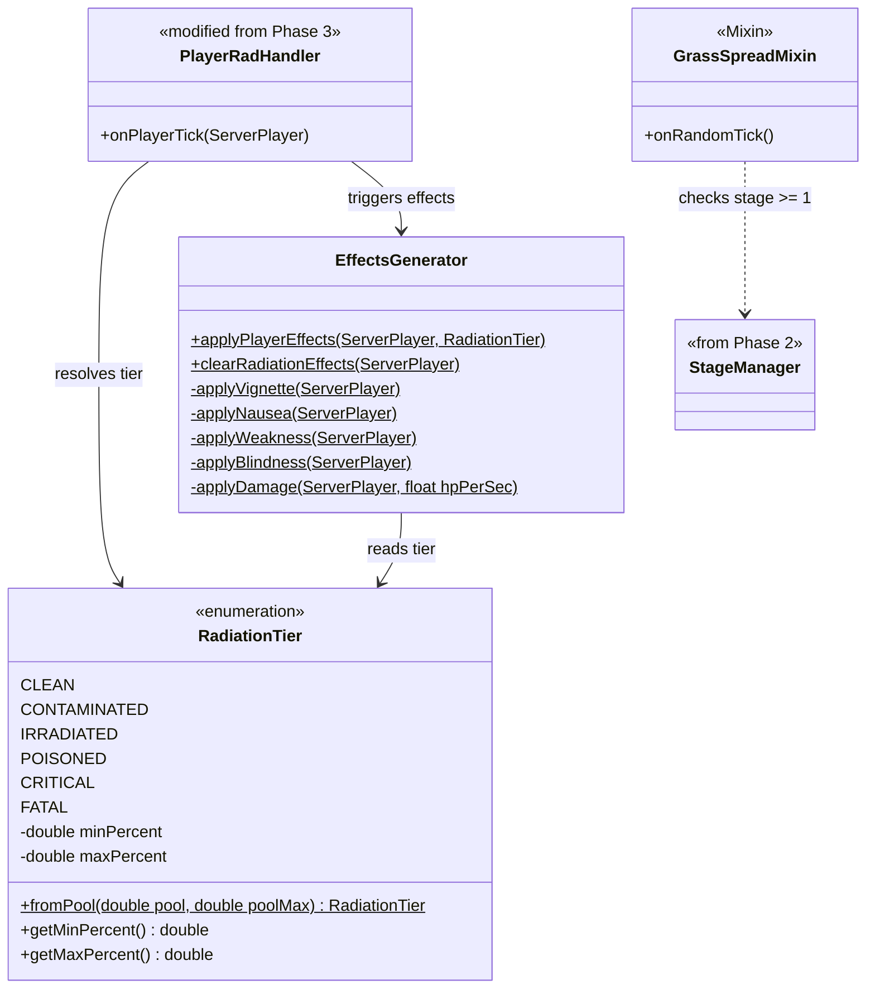

# Phase 5: Player Effects — Implementation Plan

> **For Claude:** REQUIRED SUB-SKILL: Use superpowers:executing-plans to implement this plan task-by-task.

**Goal:** Apply gameplay consequences based on radiation pool level — nausea, weakness, blindness, HP damage, healing reduction — and suppress grass spread via a Mixin when the apocalypse is active.

**Architecture:** `RadiationTier` is an enum mapping pool percentage ranges to named tiers (CLEAN through FATAL). `EffectsGenerator` is a static helper that applies/removes Minecraft `MobEffect` instances based on the player's current tier. `PlayerRadHandler` (from Phase 3) is extended to call `EffectsGenerator` after updating the pool each tick. A Mixin (`GrassSpreadMixin`) injects into `SpreadingSnowyDirtBlock.randomTick` to cancel grass spread when the dimension's stage >= 1.

**Tech Stack:** NeoForge 21.1.219, Minecraft 1.21.1, Java 21, MobEffects, Mixin, `LivingHealEvent`

---

## Class Diagram — What This Phase Adds



---

## Task 1: Create RadiationTier enum

**Files:**
- Create: `src/main/java/net/tomato3017/nuclearwinter/radiation/RadiationTier.java`

**Step 1: Write the failing test**

**Files:**
- Create: `src/main/java/net/tomato3017/nuclearwinter/test/RadiationTierGameTest.java`

```java
package net.tomato3017.nuclearwinter.test;

import net.tomato3017.nuclearwinter.radiation.RadiationTier;
import net.minecraft.gametest.framework.GameTest;
import net.minecraft.gametest.framework.GameTestHelper;
import net.neoforged.neoforge.gametest.GameTestHolder;
import net.neoforged.neoforge.gametest.PrefixGameTestTemplate;

@GameTestHolder("nuclearwinter")
@PrefixGameTestTemplate(false)
public class RadiationTierGameTest {

    @GameTest(template = "empty_1x1")
    public void zeroPoolIsClean(GameTestHelper helper) {
        RadiationTier tier = RadiationTier.fromPool(0, 100_000);
        helper.assertTrue(tier == RadiationTier.CLEAN, "0 pool should be CLEAN, got " + tier);
        helper.succeed();
    }

    @GameTest(template = "empty_1x1")
    public void fullPoolIsFatal(GameTestHelper helper) {
        RadiationTier tier = RadiationTier.fromPool(100_000, 100_000);
        helper.assertTrue(tier == RadiationTier.FATAL, "Full pool should be FATAL, got " + tier);
        helper.succeed();
    }

    @GameTest(template = "empty_1x1")
    public void borderlineContaminated(GameTestHelper helper) {
        RadiationTier tier = RadiationTier.fromPool(15_000, 100_000);
        helper.assertTrue(tier == RadiationTier.CONTAMINATED,
                "15% pool should be CONTAMINATED, got " + tier);
        helper.succeed();
    }

    @GameTest(template = "empty_1x1")
    public void borderlineCritical(GameTestHelper helper) {
        RadiationTier tier = RadiationTier.fromPool(80_000, 100_000);
        helper.assertTrue(tier == RadiationTier.CRITICAL,
                "80% pool should be CRITICAL, got " + tier);
        helper.succeed();
    }
}
```

**Step 2: Run test to verify it fails**

Run: `./gradlew runGameTestServer`
Expected: FAIL — `RadiationTier` does not exist yet.

**Step 3: Write RadiationTier**

```java
package net.tomato3017.nuclearwinter.radiation;

import net.tomato3017.nuclearwinter.Config;

public enum RadiationTier {
    CLEAN(0.0, 0.15),
    CONTAMINATED(0.15, 0.35),
    IRRADIATED(0.35, 0.60),
    POISONED(0.60, 0.80),
    CRITICAL(0.80, 1.0),
    FATAL(1.0, 1.0);

    private final double defaultMinPercent;
    private final double defaultMaxPercent;

    RadiationTier(double defaultMinPercent, double defaultMaxPercent) {
        this.defaultMinPercent = defaultMinPercent;
        this.defaultMaxPercent = defaultMaxPercent;
    }

    public double getMinPercent() { return defaultMinPercent; }
    public double getMaxPercent() { return defaultMaxPercent; }

    public static RadiationTier fromPool(double pool, double poolMax) {
        if (poolMax <= 0) return CLEAN;
        double percent = pool / poolMax;

        if (percent >= 1.0) return FATAL;

        double contaminated = Config.THRESHOLD_CONTAMINATED.get();
        double irradiated = Config.THRESHOLD_IRRADIATED.get();
        double poisoned = Config.THRESHOLD_POISONED.get();
        double critical = Config.THRESHOLD_CRITICAL.get();

        if (percent >= critical) return CRITICAL;
        if (percent >= poisoned) return POISONED;
        if (percent >= irradiated) return IRRADIATED;
        if (percent >= contaminated) return CONTAMINATED;
        return CLEAN;
    }
}
```

**Step 4: Run test to verify it passes**

Run: `./gradlew runGameTestServer`
Expected: All 4 tier tests PASS

**Step 5: Commit**

```bash
git add -A
git commit -m "feat: add RadiationTier enum with threshold resolution"
```

---

## Task 2: Create EffectsGenerator

**Files:**
- Create: `src/main/java/net/tomato3017/nuclearwinter/effects/EffectsGenerator.java`

**Step 1: Write EffectsGenerator**

```java
package net.tomato3017.nuclearwinter.effects;

import net.tomato3017.nuclearwinter.radiation.RadiationTier;
import net.minecraft.server.level.ServerPlayer;
import net.minecraft.world.effect.MobEffectInstance;
import net.minecraft.world.effect.MobEffects;

public class EffectsGenerator {
    private static final int EFFECT_DURATION = 60;
    private static final int BLINDNESS_RESIDUAL_TICKS = 200;

    public static void applyPlayerEffects(ServerPlayer player, RadiationTier tier) {
        switch (tier) {
            case CLEAN:
                break;
            case CONTAMINATED:
                break;
            case IRRADIATED:
                applyNausea(player);
                break;
            case POISONED:
                applyWeakness(player);
                break;
            case CRITICAL:
                applyBlindness(player);
                break;
            case FATAL:
                applyBlindness(player);
                applyDamage(player, 2.0f);
                break;
        }
    }

    public static void clearRadiationEffects(ServerPlayer player) {
        // Effects have short durations and will expire naturally.
        // Only forcibly remove effects that linger (blindness has residual).
    }

    private static void applyNausea(ServerPlayer player) {
        player.addEffect(new MobEffectInstance(MobEffects.CONFUSION, EFFECT_DURATION, 0, false, false, true));
    }

    private static void applyWeakness(ServerPlayer player) {
        player.addEffect(new MobEffectInstance(MobEffects.WEAKNESS, EFFECT_DURATION, 0, false, false, true));
    }

    private static void applyBlindness(ServerPlayer player) {
        player.addEffect(new MobEffectInstance(MobEffects.DARKNESS, BLINDNESS_RESIDUAL_TICKS, 0, false, false, true));
    }

    private static void applyDamage(ServerPlayer player, float hpPerSec) {
        float damagePerTick = hpPerSec / 20.0f;
        player.hurt(player.damageSources().magic(), damagePerTick);
    }
}
```

**Step 2: Verify it compiles**

Run: `./gradlew build`
Expected: BUILD SUCCESSFUL

**Step 3: Commit**

```bash
git add -A
git commit -m "feat: add EffectsGenerator for tier-based mob effects"
```

---

## Task 3: Integrate EffectsGenerator into PlayerRadHandler

**Files:**
- Modify: `src/main/java/net/tomato3017/nuclearwinter/radiation/PlayerRadHandler.java`

**Step 1: Add effect application after pool update**

At the end of the `onPlayerTick` method, after updating the pool, add:

```java
double poolMax = Config.PLAYER_POOL_MAX.get();
RadiationTier tier = RadiationTier.fromPool(pool, poolMax);
EffectsGenerator.applyPlayerEffects(player, tier);
```

Add the import:
```java
import net.tomato3017.nuclearwinter.effects.EffectsGenerator;
```

The pool variable is already computed earlier in the method. The tier resolution and effect application runs on the same interval as the raycast.

**Step 2: Verify it compiles**

Run: `./gradlew build`
Expected: BUILD SUCCESSFUL

**Step 3: Commit**

```bash
git add -A
git commit -m "feat: integrate EffectsGenerator into PlayerRadHandler tick"
```

---

## Task 4: Implement healing reduction

**Files:**
- Modify: `src/main/java/net/tomato3017/nuclearwinter/NuclearWinter.java`

**Step 1: Add a healing event handler**

NeoForge fires `LivingHealEvent` when an entity heals. Intercept it for players based on their radiation tier:

```java
@SubscribeEvent
public void onPlayerHeal(LivingHealEvent event) {
    if (!(event.getEntity() instanceof ServerPlayer player)) return;

    PlayerDataAttachment data = player.getData(NWAttachmentTypes.PLAYER_DATA);
    RadiationTier tier = RadiationTier.fromPool(data.radiationPool(), Config.PLAYER_POOL_MAX.get());

    switch (tier) {
        case CONTAMINATED:
            event.setAmount(event.getAmount() * 0.75f);
            break;
        case IRRADIATED:
            event.setAmount(event.getAmount() * 0.25f);
            break;
        case POISONED:
        case CRITICAL:
        case FATAL:
            event.setCanceled(true);
            break;
        default:
            break;
    }
}
```

Add imports:
```java
import net.tomato3017.nuclearwinter.data.PlayerDataAttachment;
import net.tomato3017.nuclearwinter.radiation.RadiationTier;
import net.neoforged.neoforge.event.entity.living.LivingHealEvent;
```

**Step 2: Verify it compiles**

Run: `./gradlew build`
Expected: BUILD SUCCESSFUL

**Step 3: Commit**

```bash
git add -A
git commit -m "feat: reduce/block healing based on radiation tier"
```

---

## Task 5: Create GrassSpreadMixin

**Files:**
- Create: `src/main/java/net/tomato3017/nuclearwinter/mixin/GrassSpreadMixin.java`
- Modify: `src/main/resources/nuclearwinter.mixins.json`

**Step 1: Write the Mixin**

```java
package net.tomato3017.nuclearwinter.mixin;

import net.tomato3017.nuclearwinter.NuclearWinter;
import net.tomato3017.nuclearwinter.stage.StageBase;
import net.minecraft.core.BlockPos;
import net.minecraft.server.level.ServerLevel;
import net.minecraft.util.RandomSource;
import net.minecraft.world.level.block.SpreadingSnowyDirtBlock;
import net.minecraft.world.level.block.state.BlockState;
import org.spongepowered.asm.mixin.Mixin;
import org.spongepowered.asm.mixin.injection.At;
import org.spongepowered.asm.mixin.injection.Inject;
import org.spongepowered.asm.mixin.injection.callback.CallbackInfo;

@Mixin(SpreadingSnowyDirtBlock.class)
public class GrassSpreadMixin {

    @Inject(method = "randomTick", at = @At("HEAD"), cancellable = true)
    private void onRandomTick(BlockState state, ServerLevel level, BlockPos pos, RandomSource random, CallbackInfo ci) {
        if (NuclearWinter.getStageManager() == null) return;

        StageBase stage = NuclearWinter.getStageManager().getStageForWorld(level.dimension());
        if (stage != null && stage.getStageIndex() >= 2) {
            ci.cancel();
        }
    }
}
```

The check is `stageIndex >= 2` because stage index 2 corresponds to Stage 1 in the design (index 0 = Stage 0, index 1 = Grace Period, index 2 = Stage 1). Per the design doc, grass stops spreading at Stage 1.

**Step 2: Register the Mixin**

Update `src/main/resources/nuclearwinter.mixins.json`:

```json
{
  "required": true,
  "package": "net.tomato3017.nuclearwinter.mixin",
  "compatibilityLevel": "JAVA_21",
  "mixins": [
    "GrassSpreadMixin"
  ],
  "injectors": {
    "defaultRequire": 1
  },
  "overwrites": {
    "requireAnnotations": true
  }
}
```

**Step 3: Verify it compiles**

Run: `./gradlew build`
Expected: BUILD SUCCESSFUL

**Step 4: Commit**

```bash
git add -A
git commit -m "feat: add GrassSpreadMixin to suppress grass spread at Stage 1+"
```

---

## Task 6: Add hunger drain at Irradiated tier

**Files:**
- Modify: `src/main/java/net/tomato3017/nuclearwinter/effects/EffectsGenerator.java`

**Step 1: Add hunger effect**

The design says "Hunger drains faster" at Irradiated. Apply the Hunger mob effect:

In the `IRRADIATED` case of `applyPlayerEffects`, add:

```java
case IRRADIATED:
    applyNausea(player);
    applyHunger(player);
    break;
```

Add the method:

```java
private static void applyHunger(ServerPlayer player) {
    player.addEffect(new MobEffectInstance(MobEffects.HUNGER, EFFECT_DURATION, 0, false, false, true));
}
```

**Step 2: Verify it compiles**

Run: `./gradlew build`
Expected: BUILD SUCCESSFUL

**Step 3: Commit**

```bash
git add -A
git commit -m "feat: add hunger drain at Irradiated tier"
```

---

## Task 7: Add lang entries for effects (optional UX polish)

**Files:**
- Modify: `src/main/resources/assets/nuclearwinter/lang/en_us.json`

**Step 1: Add radiation tier names to lang file**

Append to the lang file:

```json
"nuclearwinter.tier.clean": "Clean",
"nuclearwinter.tier.contaminated": "Contaminated",
"nuclearwinter.tier.irradiated": "Irradiated",
"nuclearwinter.tier.poisoned": "Poisoned",
"nuclearwinter.tier.critical": "Critical",
"nuclearwinter.tier.fatal": "Fatal"
```

These can be used by the debug commands or future HUD elements to display the player's current tier.

**Step 2: Commit**

```bash
git add -A
git commit -m "feat: add radiation tier lang entries"
```

---

## Manual Testing Checklist

After completing all tasks above, perform these manual tests:

1. **CLEAN tier — no effects:** Start apocalypse, stay underground. Pool at 0%. Verify no nausea, no weakness, no blindness. Healing works normally (eat food to test).

2. **CONTAMINATED tier (15-35%) — healing reduced:** Use `/nuclearwinter setstage minecraft:overworld 4` (Stage 3, 333 Rads/sec). Stand in open sky briefly until pool reaches ~20%. Go underground. Try to heal (eat food) — healing should be reduced by 25%.

3. **IRRADIATED tier (35-60%) — nausea + hunger:** Let pool reach ~40%. Verify: screen warps (nausea effect), hunger bar drains faster than normal, healing reduced by 75%.

4. **POISONED tier (60-80%) — weakness + no healing:** Let pool reach ~65%. Verify: Weakness I is applied (reduced attack damage). Eating food does NOT restore hearts.

5. **CRITICAL tier (80-99%) — blindness:** Let pool reach ~85%. Verify: Screen darkens significantly (Darkness effect, not full black). No healing. Check that attack damage is still reduced (weakness carries over from Poisoned if effects stack).

6. **FATAL tier (100%) — HP damage + blindness:** Let pool reach 100%. Verify: Player takes ~2 HP/sec damage. Screen is dark. No healing. Player should die in about 10 seconds from full health.

7. **Effects clear on drain:** After reaching Fatal, use `/nuclearwinter debug resetrad` to clear pool. Verify: blindness lingers for ~10 seconds (residual), then clears. No more damage. Healing works again.

8. **Grass spread suppression:** Create a new creative world. Place dirt blocks next to grass blocks with sky access. Run `/nuclearwinter start minecraft:overworld`. Wait 1 minute. Verify: grass does NOT spread to adjacent dirt. Stop the apocalypse. Wait again. Verify: grass resumes spreading.

9. **Effects don't apply when no apocalypse:** Stop the apocalypse entirely. Even if a player has residual pool, verify no effects are applied when the stage is 0 (radiation is not being emitted, pool drains naturally).
