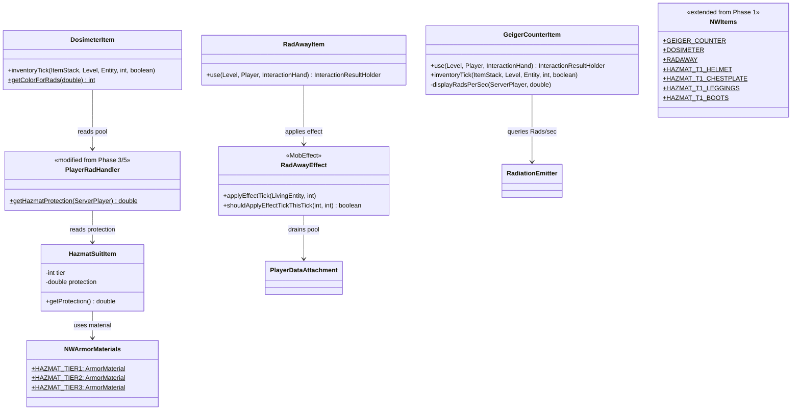

# Phase 6: Equipment & Items — Implementation Plan

> **For Claude:** REQUIRED SUB-SKILL: Use superpowers:executing-plans to implement this plan task-by-task.

**Goal:** Give players tools to measure, treat, and protect against radiation — Geiger Counter, Dosimeter, RadAway (item + MobEffect), and Hazmat Suit (3 tiers of armor).

**Architecture:** Each equipment item is registered via the existing `NWItems` DeferredRegister. The Geiger Counter is a simple `Item` that, when held in hand, displays Rads/sec on the action bar. The Dosimeter is a hotbar-passive item that renders a color overlay on the client. RadAway is an item that applies a custom `MobEffect` (`RadAwayEffect`) which drains the player's radiation pool over 3 minutes. Hazmat Suit pieces are registered as armor items with a custom `ArmorMaterial`; the `PlayerRadHandler` checks equipped armor to apply percentage-based radiation reduction after the raycast.

**Tech Stack:** NeoForge 21.1.219, Minecraft 1.21.1, Java 21, `MobEffect`, `ArmorMaterial`, `DeferredRegister`, Client HUD overlay

---

## Class Diagram — What This Phase Adds



---

## Task 1: Create RadAwayEffect (custom MobEffect)

**Files:**
- Create: `src/main/java/net/tomato3017/nuclearwinter/effects/RadAwayEffect.java`
- Create: `src/main/java/net/tomato3017/nuclearwinter/effects/NWMobEffects.java`
- Modify: `src/main/java/net/tomato3017/nuclearwinter/NuclearWinter.java`

**Step 1: Write the failing test**

**Files:**
- Create: `src/main/java/net/tomato3017/nuclearwinter/test/RadAwayGameTest.java`

```java
package net.tomato3017.nuclearwinter.test;

import net.tomato3017.nuclearwinter.Config;
import net.minecraft.gametest.framework.GameTest;
import net.minecraft.gametest.framework.GameTestHelper;
import net.neoforged.neoforge.gametest.GameTestHolder;
import net.neoforged.neoforge.gametest.PrefixGameTestTemplate;

@GameTestHolder("nuclearwinter")
@PrefixGameTestTemplate(false)
public class RadAwayGameTest {

    @GameTest(template = "empty_1x1")
    public void radAwayDrainRate(GameTestHelper helper) {
        double totalReduction = Config.RADAWAY_REDUCTION.get();
        int durationTicks = Config.RADAWAY_DURATION_TICKS.get();
        double drainPerTick = totalReduction / durationTicks;
        helper.assertTrue(Math.abs(drainPerTick - (50000.0 / 3600.0)) < 1.0,
                "Drain per tick should be ~13.89, got " + drainPerTick);
        helper.succeed();
    }
}
```

**Step 2: Run test to verify it fails**

Run: `./gradlew runGameTestServer`
Expected: FAIL or PASS depending on Config availability — this primarily validates the math.

**Step 3: Write RadAwayEffect**

```java
package net.tomato3017.nuclearwinter.effects;

import net.tomato3017.nuclearwinter.Config;
import net.tomato3017.nuclearwinter.data.NWAttachmentTypes;
import net.tomato3017.nuclearwinter.data.PlayerDataAttachment;
import net.minecraft.server.level.ServerPlayer;
import net.minecraft.world.effect.MobEffect;
import net.minecraft.world.effect.MobEffectCategory;
import net.minecraft.world.entity.LivingEntity;

public class RadAwayEffect extends MobEffect {
    public RadAwayEffect() {
        super(MobEffectCategory.BENEFICIAL, 0x55FF55);
    }

    @Override
    public boolean applyEffectTick(LivingEntity entity, int amplifier) {
        if (entity instanceof ServerPlayer player) {
            double totalReduction = Config.RADAWAY_REDUCTION.get();
            int durationTicks = Config.RADAWAY_DURATION_TICKS.get();
            double drainPerTick = totalReduction / durationTicks;

            PlayerDataAttachment data = player.getData(NWAttachmentTypes.PLAYER_DATA);
            double newPool = Math.max(data.radiationPool() - drainPerTick, 0.0);
            player.setData(NWAttachmentTypes.PLAYER_DATA, data.withRadiationPool(newPool));
        }
        return true;
    }

    @Override
    public boolean shouldApplyEffectTickThisTick(int duration, int amplifier) {
        return true;
    }
}
```

**Step 4: Create NWMobEffects registration class**

```java
package net.tomato3017.nuclearwinter.effects;

import net.tomato3017.nuclearwinter.NuclearWinter;
import net.minecraft.core.registries.Registries;
import net.minecraft.world.effect.MobEffect;
import net.neoforged.neoforge.registries.DeferredHolder;
import net.neoforged.neoforge.registries.DeferredRegister;

public class NWMobEffects {
    public static final DeferredRegister<MobEffect> MOB_EFFECTS =
            DeferredRegister.create(Registries.MOB_EFFECT, NuclearWinter.MODID);

    public static final DeferredHolder<MobEffect, RadAwayEffect> RADAWAY =
            MOB_EFFECTS.register("radaway", RadAwayEffect::new);
}
```

**Step 5: Register in NuclearWinter constructor**

Add to the constructor:

```java
NWMobEffects.MOB_EFFECTS.register(modEventBus);
```

Add import:
```java
import net.tomato3017.nuclearwinter.effects.NWMobEffects;
```

**Step 6: Verify it compiles**

Run: `./gradlew build`
Expected: BUILD SUCCESSFUL

**Step 7: Commit**

```bash
git add -A
git commit -m "feat: add RadAwayEffect custom MobEffect with pool drain"
```

---

## Task 2: Create RadAway item

**Files:**
- Modify: `src/main/java/net/tomato3017/nuclearwinter/item/NWItems.java`

**Step 1: Register RadAway item**

Add to `NWItems.java`:

```java
public static final DeferredItem<Item> RADAWAY = ITEMS.register("radaway",
        () -> new RadAwayItem(new Item.Properties().stacksTo(16)));
```

**Step 2: Create RadAwayItem class**

**Files:**
- Create: `src/main/java/net/tomato3017/nuclearwinter/item/RadAwayItem.java`

```java
package net.tomato3017.nuclearwinter.item;

import net.tomato3017.nuclearwinter.Config;
import net.tomato3017.nuclearwinter.effects.NWMobEffects;
import net.minecraft.world.InteractionHand;
import net.minecraft.world.InteractionResultHolder;
import net.minecraft.world.effect.MobEffectInstance;
import net.minecraft.world.entity.player.Player;
import net.minecraft.world.item.Item;
import net.minecraft.world.item.ItemStack;
import net.minecraft.world.level.Level;

public class RadAwayItem extends Item {
    public RadAwayItem(Properties properties) {
        super(properties);
    }

    @Override
    public InteractionResultHolder<ItemStack> use(Level level, Player player, InteractionHand hand) {
        ItemStack stack = player.getItemInHand(hand);
        if (!level.isClientSide) {
            int duration = Config.RADAWAY_DURATION_TICKS.get();
            player.addEffect(new MobEffectInstance(NWMobEffects.RADAWAY, duration, 0, false, true, true));
            if (!player.getAbilities().instabuild) {
                stack.shrink(1);
            }
        }
        return InteractionResultHolder.sidedSuccess(stack, level.isClientSide);
    }
}
```

**Step 3: Add to creative tab and lang**

In `NuclearWinter.java`, add `output.accept(NWItems.RADAWAY.get());` to the creative tab's `displayItems` lambda.

In `en_us.json`, add:
```json
"item.nuclearwinter.radaway": "RadAway"
```

**Step 4: Create placeholder item model and texture**

Create `src/main/resources/assets/nuclearwinter/models/item/radaway.json`:
```json
{
  "parent": "minecraft:item/generated",
  "textures": {
    "layer0": "nuclearwinter:item/radaway"
  }
}
```

Create a 16x16 placeholder PNG at `src/main/resources/assets/nuclearwinter/textures/item/radaway.png` — use green color `#55FF55`.

**Step 5: Verify it compiles**

Run: `./gradlew build`
Expected: BUILD SUCCESSFUL

**Step 6: Commit**

```bash
git add -A
git commit -m "feat: add RadAway consumable item"
```

---

## Task 3: Create Geiger Counter item

**Files:**
- Create: `src/main/java/net/tomato3017/nuclearwinter/item/GeigerCounterItem.java`
- Modify: `src/main/java/net/tomato3017/nuclearwinter/item/NWItems.java`

**Step 1: Write GeigerCounterItem**

```java
package net.tomato3017.nuclearwinter.item;

import net.tomato3017.nuclearwinter.NuclearWinter;
import net.tomato3017.nuclearwinter.radiation.RadiationEmitter;
import net.tomato3017.nuclearwinter.stage.StageBase;
import net.minecraft.network.chat.Component;
import net.minecraft.server.level.ServerPlayer;
import net.minecraft.world.entity.Entity;
import net.minecraft.world.item.Item;
import net.minecraft.world.item.ItemStack;
import net.minecraft.world.level.Level;

public class GeigerCounterItem extends Item {
    private static final int DISPLAY_INTERVAL = 10;

    public GeigerCounterItem(Properties properties) {
        super(properties);
    }

    @Override
    public void inventoryTick(ItemStack stack, Level level, Entity entity, int slotId, boolean isSelected) {
        if (level.isClientSide) return;
        if (!(entity instanceof ServerPlayer player)) return;
        if (!isSelected) return;

        if (level.getGameTime() % DISPLAY_INTERVAL != 0) return;

        StageBase stage = NuclearWinter.getStageManager().getStageForWorld(level.dimension());
        double radsPerSec = 0.0;
        if (stage != null && stage.getSkyEmission() > 0) {
            radsPerSec = RadiationEmitter.raycastDown(level, player.blockPosition(), stage.getSkyEmission());
        }

        player.displayClientMessage(Component.literal(String.format("☢ %.1f Rads/sec", radsPerSec)), true);
    }
}
```

**Step 2: Register in NWItems**

```java
public static final DeferredItem<Item> GEIGER_COUNTER = ITEMS.register("geiger_counter",
        () -> new GeigerCounterItem(new Item.Properties().stacksTo(1)));
```

**Step 3: Add to creative tab and lang**

Add `output.accept(NWItems.GEIGER_COUNTER.get());` to the creative tab.

In `en_us.json`, add:
```json
"item.nuclearwinter.geiger_counter": "Geiger Counter"
```

**Step 4: Create placeholder item model and texture**

Create `src/main/resources/assets/nuclearwinter/models/item/geiger_counter.json`:
```json
{
  "parent": "minecraft:item/generated",
  "textures": {
    "layer0": "nuclearwinter:item/geiger_counter"
  }
}
```

Create a 16x16 placeholder PNG at `src/main/resources/assets/nuclearwinter/textures/item/geiger_counter.png` — use yellow color `#FFDD00`.

**Step 5: Verify it compiles**

Run: `./gradlew build`
Expected: BUILD SUCCESSFUL

**Step 6: Commit**

```bash
git add -A
git commit -m "feat: add Geiger Counter item with action bar display"
```

---

## Task 4: Create Dosimeter item

**Files:**
- Create: `src/main/java/net/tomato3017/nuclearwinter/item/DosimeterItem.java`
- Modify: `src/main/java/net/tomato3017/nuclearwinter/item/NWItems.java`

**Step 1: Write DosimeterItem**

```java
package net.tomato3017.nuclearwinter.item;

import net.tomato3017.nuclearwinter.Config;
import net.tomato3017.nuclearwinter.data.NWAttachmentTypes;
import net.tomato3017.nuclearwinter.data.PlayerDataAttachment;
import net.minecraft.network.chat.Component;
import net.minecraft.network.chat.Style;
import net.minecraft.network.chat.TextColor;
import net.minecraft.server.level.ServerPlayer;
import net.minecraft.world.entity.Entity;
import net.minecraft.world.entity.player.Inventory;
import net.minecraft.world.entity.player.Player;
import net.minecraft.world.item.Item;
import net.minecraft.world.item.ItemStack;
import net.minecraft.world.level.Level;

public class DosimeterItem extends Item {
    private static final int DISPLAY_INTERVAL = 20;

    public DosimeterItem(Properties properties) {
        super(properties);
    }

    @Override
    public void inventoryTick(ItemStack stack, Level level, Entity entity, int slotId, boolean isSelected) {
        if (level.isClientSide) return;
        if (!(entity instanceof ServerPlayer player)) return;
        if (!isInHotbar(slotId)) return;
        if (level.getGameTime() % DISPLAY_INTERVAL != 0) return;

        PlayerDataAttachment data = player.getData(NWAttachmentTypes.PLAYER_DATA);
        double pool = data.radiationPool();
        int color = getColorForRads(pool);

        player.displayClientMessage(
                Component.literal(String.format("▮ Radiation: %.0f Rads", pool))
                        .setStyle(Style.EMPTY.withColor(TextColor.fromRgb(color))),
                true);
    }

    private static boolean isInHotbar(int slotId) {
        return slotId >= 0 && slotId < Inventory.getSelectionSize();
    }

    public static int getColorForRads(double pool) {
        double fullRed = Config.DOSIMETER_FULL_RED.get();
        double ratio = Math.min(pool / fullRed, 1.0);

        int red = (int) (255 * ratio);
        int green = (int) (255 * (1.0 - ratio));
        return (red << 16) | (green << 8);
    }
}
```

**Step 2: Register in NWItems**

```java
public static final DeferredItem<Item> DOSIMETER = ITEMS.register("dosimeter",
        () -> new DosimeterItem(new Item.Properties().stacksTo(1)));
```

**Step 3: Add to creative tab and lang**

Add `output.accept(NWItems.DOSIMETER.get());` to the creative tab.

In `en_us.json`, add:
```json
"item.nuclearwinter.dosimeter": "Dosimeter"
```

**Step 4: Create placeholder item model and texture**

Create `src/main/resources/assets/nuclearwinter/models/item/dosimeter.json`:
```json
{
  "parent": "minecraft:item/generated",
  "textures": {
    "layer0": "nuclearwinter:item/dosimeter"
  }
}
```

Create a 16x16 placeholder PNG at `src/main/resources/assets/nuclearwinter/textures/item/dosimeter.png` — use cyan color `#00CCCC`.

**Step 5: Verify it compiles**

Run: `./gradlew build`
Expected: BUILD SUCCESSFUL

**Step 6: Commit**

```bash
git add -A
git commit -m "feat: add Dosimeter item with color gradient display"
```

---

## Task 5: Create Hazmat Suit armor

**Files:**
- Create: `src/main/java/net/tomato3017/nuclearwinter/item/NWArmorMaterials.java`
- Create: `src/main/java/net/tomato3017/nuclearwinter/item/HazmatSuitItem.java`
- Modify: `src/main/java/net/tomato3017/nuclearwinter/item/NWItems.java`

**Step 1: Create NWArmorMaterials**

In NeoForge 1.21.1, armor materials are registered as data-driven entries. Create the armor material registration:

```java
package net.tomato3017.nuclearwinter.item;

import net.tomato3017.nuclearwinter.NuclearWinter;
import net.minecraft.Util;
import net.minecraft.core.Holder;
import net.minecraft.core.Registry;
import net.minecraft.core.registries.BuiltInRegistries;
import net.minecraft.resources.ResourceLocation;
import net.minecraft.sounds.SoundEvents;
import net.minecraft.world.item.ArmorItem;
import net.minecraft.world.item.ArmorMaterial;
import net.minecraft.world.item.crafting.Ingredient;

import java.util.EnumMap;
import java.util.List;
import java.util.Map;
import java.util.function.Supplier;

public class NWArmorMaterials {
    private static final Map<ArmorItem.Type, Integer> HAZMAT_DEFENSE = Util.make(
            new EnumMap<>(ArmorItem.Type.class), map -> {
                map.put(ArmorItem.Type.HELMET, 1);
                map.put(ArmorItem.Type.CHESTPLATE, 3);
                map.put(ArmorItem.Type.LEGGINGS, 2);
                map.put(ArmorItem.Type.BOOTS, 1);
            });

    public static final Holder<ArmorMaterial> HAZMAT_TIER1 = register("hazmat_tier1",
            HAZMAT_DEFENSE, 9, SoundEvents.ARMOR_EQUIP_LEATHER, 0.0f, 0.0f,
            () -> Ingredient.of(net.minecraft.world.item.Items.LEATHER));

    public static final Holder<ArmorMaterial> HAZMAT_TIER2 = register("hazmat_tier2",
            HAZMAT_DEFENSE, 15, SoundEvents.ARMOR_EQUIP_CHAIN, 0.0f, 0.0f,
            () -> Ingredient.of(net.minecraft.world.item.Items.IRON_INGOT));

    public static final Holder<ArmorMaterial> HAZMAT_TIER3 = register("hazmat_tier3",
            HAZMAT_DEFENSE, 25, SoundEvents.ARMOR_EQUIP_IRON, 1.0f, 0.0f,
            () -> Ingredient.of(net.minecraft.world.item.Items.DIAMOND));

    private static Holder<ArmorMaterial> register(String name,
            Map<ArmorItem.Type, Integer> defense, int enchantability,
            Holder<net.minecraft.sounds.SoundEvent> equipSound,
            float toughness, float knockbackResistance,
            Supplier<Ingredient> repairIngredient) {
        ResourceLocation id = ResourceLocation.fromNamespaceAndPath(NuclearWinter.MODID, name);

        List<ArmorMaterial.Layer> layers = List.of(new ArmorMaterial.Layer(id));

        return Registry.registerForHolder(BuiltInRegistries.ARMOR_MATERIAL, id,
                new ArmorMaterial(defense, enchantability, equipSound, repairIngredient,
                        layers, toughness, knockbackResistance));
    }

    public static void init() {
        // Force static initialization
    }
}
```

**Step 2: Create HazmatSuitItem**

```java
package net.tomato3017.nuclearwinter.item;

import net.minecraft.core.Holder;
import net.minecraft.world.item.ArmorItem;
import net.minecraft.world.item.ArmorMaterial;

public class HazmatSuitItem extends ArmorItem {
    private final int tier;
    private final double protection;

    public HazmatSuitItem(Holder<ArmorMaterial> material, Type type, Properties properties,
                          int tier, double protection) {
        super(material, type, properties);
        this.tier = tier;
        this.protection = protection;
    }

    public int getTier() { return tier; }
    public double getProtection() { return protection; }
}
```

**Step 3: Register armor items in NWItems**

```java
// Hazmat Tier 1
public static final DeferredItem<ArmorItem> HAZMAT_T1_HELMET = ITEMS.register("hazmat_t1_helmet",
        () -> new HazmatSuitItem(NWArmorMaterials.HAZMAT_TIER1, ArmorItem.Type.HELMET,
                new Item.Properties(), 1, 0.67));
public static final DeferredItem<ArmorItem> HAZMAT_T1_CHESTPLATE = ITEMS.register("hazmat_t1_chestplate",
        () -> new HazmatSuitItem(NWArmorMaterials.HAZMAT_TIER1, ArmorItem.Type.CHESTPLATE,
                new Item.Properties(), 1, 0.67));
public static final DeferredItem<ArmorItem> HAZMAT_T1_LEGGINGS = ITEMS.register("hazmat_t1_leggings",
        () -> new HazmatSuitItem(NWArmorMaterials.HAZMAT_TIER1, ArmorItem.Type.LEGGINGS,
                new Item.Properties(), 1, 0.67));
public static final DeferredItem<ArmorItem> HAZMAT_T1_BOOTS = ITEMS.register("hazmat_t1_boots",
        () -> new HazmatSuitItem(NWArmorMaterials.HAZMAT_TIER1, ArmorItem.Type.BOOTS,
                new Item.Properties(), 1, 0.67));

// Hazmat Tier 2
public static final DeferredItem<ArmorItem> HAZMAT_T2_HELMET = ITEMS.register("hazmat_t2_helmet",
        () -> new HazmatSuitItem(NWArmorMaterials.HAZMAT_TIER2, ArmorItem.Type.HELMET,
                new Item.Properties(), 2, 0.92));
public static final DeferredItem<ArmorItem> HAZMAT_T2_CHESTPLATE = ITEMS.register("hazmat_t2_chestplate",
        () -> new HazmatSuitItem(NWArmorMaterials.HAZMAT_TIER2, ArmorItem.Type.CHESTPLATE,
                new Item.Properties(), 2, 0.92));
public static final DeferredItem<ArmorItem> HAZMAT_T2_LEGGINGS = ITEMS.register("hazmat_t2_leggings",
        () -> new HazmatSuitItem(NWArmorMaterials.HAZMAT_TIER2, ArmorItem.Type.LEGGINGS,
                new Item.Properties(), 2, 0.92));
public static final DeferredItem<ArmorItem> HAZMAT_T2_BOOTS = ITEMS.register("hazmat_t2_boots",
        () -> new HazmatSuitItem(NWArmorMaterials.HAZMAT_TIER2, ArmorItem.Type.BOOTS,
                new Item.Properties(), 2, 0.92));

// Hazmat Tier 3
public static final DeferredItem<ArmorItem> HAZMAT_T3_HELMET = ITEMS.register("hazmat_t3_helmet",
        () -> new HazmatSuitItem(NWArmorMaterials.HAZMAT_TIER3, ArmorItem.Type.HELMET,
                new Item.Properties(), 3, 0.99));
public static final DeferredItem<ArmorItem> HAZMAT_T3_CHESTPLATE = ITEMS.register("hazmat_t3_chestplate",
        () -> new HazmatSuitItem(NWArmorMaterials.HAZMAT_TIER3, ArmorItem.Type.CHESTPLATE,
                new Item.Properties(), 3, 0.99));
public static final DeferredItem<ArmorItem> HAZMAT_T3_LEGGINGS = ITEMS.register("hazmat_t3_leggings",
        () -> new HazmatSuitItem(NWArmorMaterials.HAZMAT_TIER3, ArmorItem.Type.LEGGINGS,
                new Item.Properties(), 3, 0.99));
public static final DeferredItem<ArmorItem> HAZMAT_T3_BOOTS = ITEMS.register("hazmat_t3_boots",
        () -> new HazmatSuitItem(NWArmorMaterials.HAZMAT_TIER3, ArmorItem.Type.BOOTS,
                new Item.Properties(), 3, 0.99));
```

**Step 4: Add to creative tab and lang**

Add all items to the creative tab's `displayItems` lambda.

In `en_us.json`, add:
```json
"item.nuclearwinter.hazmat_t1_helmet": "Hazmat Suit Mk.I Helmet",
"item.nuclearwinter.hazmat_t1_chestplate": "Hazmat Suit Mk.I Chestplate",
"item.nuclearwinter.hazmat_t1_leggings": "Hazmat Suit Mk.I Leggings",
"item.nuclearwinter.hazmat_t1_boots": "Hazmat Suit Mk.I Boots",
"item.nuclearwinter.hazmat_t2_helmet": "Hazmat Suit Mk.II Helmet",
"item.nuclearwinter.hazmat_t2_chestplate": "Hazmat Suit Mk.II Chestplate",
"item.nuclearwinter.hazmat_t2_leggings": "Hazmat Suit Mk.II Leggings",
"item.nuclearwinter.hazmat_t2_boots": "Hazmat Suit Mk.II Boots",
"item.nuclearwinter.hazmat_t3_helmet": "Hazmat Suit Mk.III Helmet",
"item.nuclearwinter.hazmat_t3_chestplate": "Hazmat Suit Mk.III Chestplate",
"item.nuclearwinter.hazmat_t3_leggings": "Hazmat Suit Mk.III Leggings",
"item.nuclearwinter.hazmat_t3_boots": "Hazmat Suit Mk.III Boots"
```

**Step 5: Create placeholder item models**

For each armor piece, create `src/main/resources/assets/nuclearwinter/models/item/<name>.json`:

```json
{
  "parent": "minecraft:item/generated",
  "textures": {
    "layer0": "nuclearwinter:item/<name>"
  }
}
```

Create 16x16 placeholder PNGs for each at `src/main/resources/assets/nuclearwinter/textures/item/`:
- Tier 1: yellow `#CCCC00`
- Tier 2: orange `#CC8800`
- Tier 3: red `#CC0000`

**Step 6: Verify it compiles**

Run: `./gradlew build`
Expected: BUILD SUCCESSFUL

**Step 7: Commit**

```bash
git add -A
git commit -m "feat: add Hazmat Suit armor items (3 tiers)"
```

---

## Task 6: Integrate Hazmat Suit protection into PlayerRadHandler

**Files:**
- Modify: `src/main/java/net/tomato3017/nuclearwinter/radiation/PlayerRadHandler.java`

**Step 1: Add hazmat protection calculation**

Add a static method to `PlayerRadHandler`:

```java
public static double getHazmatProtection(ServerPlayer player) {
    double maxProtection = 0.0;
    for (ItemStack stack : player.getArmorSlots()) {
        if (stack.getItem() instanceof HazmatSuitItem hazmat) {
            maxProtection = Math.max(maxProtection, hazmat.getProtection());
        }
    }
    return maxProtection;
}
```

The protection model uses the **highest tier worn** — wearing a full set of the same tier gives that tier's protection. Mixing tiers uses the maximum piece.

**Step 2: Apply protection in onPlayerTick**

In the `onPlayerTick` method, after computing `radsPerSec` from the raycast, add:

```java
double hazmatProtection = getHazmatProtection(player);
if (hazmatProtection > 0) {
    radsPerSec = radsPerSec * (1.0 - hazmatProtection);
}
```

Add import:
```java
import net.tomato3017.nuclearwinter.item.HazmatSuitItem;
import net.minecraft.world.item.ItemStack;
```

**Step 3: Verify it compiles**

Run: `./gradlew build`
Expected: BUILD SUCCESSFUL

**Step 4: Commit**

```bash
git add -A
git commit -m "feat: integrate hazmat suit radiation reduction into PlayerRadHandler"
```

---

## Task 7: Add RadAway effect lang and texture

**Files:**
- Modify: `src/main/resources/assets/nuclearwinter/lang/en_us.json`

**Step 1: Add effect name**

```json
"effect.nuclearwinter.radaway": "RadAway"
```

**Step 2: Commit**

```bash
git add -A
git commit -m "feat: add RadAway effect lang entry"
```

---

## Task 8: Write GameTests for equipment

**Files:**
- Modify: `src/main/java/net/tomato3017/nuclearwinter/test/RadAwayGameTest.java`

**Step 1: Add hazmat protection test**

```java
@GameTest(template = "empty_1x1")
public void hazmatTier1Protection(GameTestHelper helper) {
    double protection = Config.SUIT_TIER1_PROTECTION.get();
    helper.assertTrue(Math.abs(protection - 0.67) < 0.01,
            "Tier 1 protection should be 0.67, got " + protection);

    double rads = 333.0;
    double reduced = rads * (1.0 - protection);
    helper.assertTrue(reduced < 120.0 && reduced > 100.0,
            "333 Rads with Tier 1 should give ~110, got " + reduced);
    helper.succeed();
}

@GameTest(template = "empty_1x1")
public void hazmatTier3Protection(GameTestHelper helper) {
    double protection = Config.SUIT_TIER3_PROTECTION.get();
    double rads = 5000.0;
    double reduced = rads * (1.0 - protection);
    helper.assertTrue(reduced < 60.0,
            "5000 Rads with Tier 3 should give ~50, got " + reduced);
    helper.succeed();
}
```

**Step 2: Run tests**

Run: `./gradlew runGameTestServer`
Expected: All tests PASS

**Step 3: Commit**

```bash
git add -A
git commit -m "test: add GameTests for RadAway and hazmat suit math"
```

---

## Manual Testing Checklist

After completing all tasks above, perform these manual tests:

1. **Geiger Counter — open sky:** `/give @s nuclearwinter:geiger_counter`. Hold it in your main hand. Start apocalypse at Stage 3. Stand in open sky. Action bar should show `☢ ~333.0 Rads/sec`.

2. **Geiger Counter — underground:** Go underground (10+ stone blocks). Action bar should show `☢ 0.0 Rads/sec`.

3. **Geiger Counter — only when held:** Put Geiger Counter in inventory (not selected). Action bar message should stop.

4. **Dosimeter — hotbar color:** `/give @s nuclearwinter:dosimeter`. Put it in your hotbar. At 0 Rads, the text should be green. Stand in radiation until pool is ~40,000 Rads — text should be yellow-ish. At ~80,000 Rads — text should be fully red.

5. **Dosimeter — not in hotbar:** Move dosimeter to main inventory (not hotbar). No display should appear.

6. **RadAway — basic usage:** Get irradiated to ~80,000 Rads pool. Use `/give @s nuclearwinter:radaway`. Right-click to use. Verify: RadAway effect icon appears in HUD. Over 3 minutes, pool should drain by 50,000 Rads (to ~30,000). Check with `/nuclearwinter debug raycast`.

7. **RadAway — does not stack:** Use a second RadAway before the first expires. Verify the effect timer resets (does not accumulate).

8. **RadAway — works while exposed:** Use RadAway while standing in open sky. Pool should still decrease (drain fights accumulation). Net change depends on radiation intake vs drain rate.

9. **Hazmat Suit Tier 1 — radiation reduction:** Equip full Hazmat Mk.I set. Stand in open sky at Stage 3 (333 Rads/sec). Use Geiger Counter — it should still show ~333 (Geiger reads raw position, not suit-adjusted). But pool fill rate should be ~67% slower than without suit. Compare: without suit pool fills in ~5 min at Stage 3; with Tier 1 it should take ~15 min.

10. **Hazmat Suit Tier 3 — Stage 4 survivability:** Equip full Hazmat Mk.III. Set stage to 4 (5000 Rads/sec). You should survive on the surface for ~30 minutes before reaching Fatal.

11. **Creative tab completeness:** Open creative tab. All new items should appear: Geiger Counter, Dosimeter, RadAway, all 12 hazmat armor pieces (4 pieces x 3 tiers).

12. **Item stacking:** Verify RadAway stacks to 16. Geiger Counter and Dosimeter stack to 1. Hazmat pieces stack to 1.
