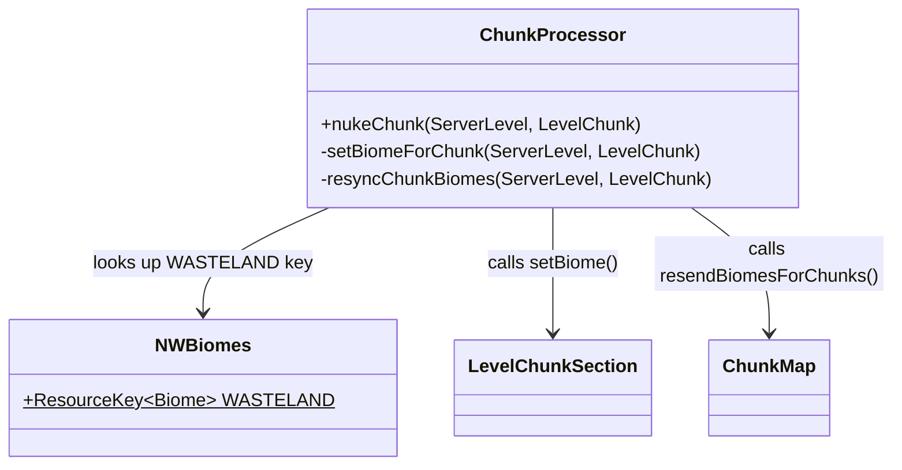

# Phase 7: Wasteland Biome — Implementation Plan

> **For Claude:** REQUIRED SUB-SKILL: Use superpowers:executing-plans to implement this plan task-by-task.
>
> **After each task:** Stop for user verification before proceeding to the next task.

**Goal:** Create a custom "Wasteland" biome with apocalyptic visuals (grey sky, dead fog, murky water) and make the `ChunkProcessor` swap every nuked chunk's biome to the new wasteland biome, including client sync.

**Architecture:** The biome is a data-driven JSON file at `data/nuclearwinter/worldgen/biome/wasteland.json`. A `ResourceKey<Biome>` constant in a new `NWBiomes` class provides compile-time type safety for registry lookups. `ChunkProcessor.nukeChunk()` is extended to overwrite the biome palette of every `LevelChunkSection` in the chunk and then trigger a client resync via `ChunkMap.resendBiomesForChunks()`. If `resendBiomesForChunks` is not accessible, an access transformer entry is added.

**Tech Stack:** NeoForge 21.1.219, Minecraft 1.21.1, Java 21, `LevelChunkSection`, `PalettedContainer<Holder<Biome>>`, `ChunkMap`, data-driven biome JSON

---

## Class Diagram — What This Phase Adds



---

## Dataflow

```
nukeChunk() called
  ├─ degrade all columns (existing)
  ├─ setBiomeForChunk()
  │    ├─ resolve Holder<Biome> from registry using NWBiomes.WASTELAND
  │    └─ for each LevelChunkSection in chunk:
  │         └─ setBiome(bx, by, bz, wastelandHolder)  (0..3 range, biome res = 4x4x4)
  ├─ resyncChunkBiomes()
  │    └─ level.getChunkSource().chunkMap.resendBiomesForChunks(List.of(chunk))
  ├─ mark chunk as nuked (existing)
  └─ chunk.setUnsaved(true) (existing)
```

---

## Task 1: Create the wasteland biome JSON

**What:** Add the data-driven biome definition.

**File:** `src/main/resources/data/nuclearwinter/worldgen/biome/wasteland.json`

```json
{
  "temperature": 2.0,
  "downfall": 0.0,
  "has_precipitation": false,
  "effects": {
    "sky_color": 7697920,
    "fog_color": 8553090,
    "water_color": 4210752,
    "water_fog_color": 4210752,
    "grass_color": 8027808,
    "foliage_color": 6579300
  },
  "spawners": {},
  "spawn_costs": {},
  "carvers": {},
  "features": []
}
```

**Color rationale:**
- `sky_color` 7697920 → `#758800` — sickly yellow-green haze
- `fog_color` 8553090 → `#828282` — thick grey fog
- `water_color` / `water_fog_color` 4210752 → `#404040` — dark murky water
- `grass_color` 8027808 → `#7A7A20` — dying yellowish grass
- `foliage_color` 6579300 → `#646464` — grey dead foliage

> **Note:** Tune these values visually after testing. The above are starting points for a scorched/dead look. You can use decimal or hex — Minecraft's biome parser accepts integers.

**Verify:** `./gradlew build` succeeds. The biome won't be used in worldgen (no `BiomeSource` references it), but it will exist in the registry for runtime lookup.

---

## Task 2: Create the `NWBiomes` constants class

**What:** A small class that holds `ResourceKey<Biome>` constants for the mod's biomes.

**File:** `src/main/java/net/tomato3017/nuclearwinter/biome/NWBiomes.java`

```java
package net.tomato3017.nuclearwinter.biome;

import net.minecraft.core.registries.Registries;
import net.minecraft.resources.ResourceKey;
import net.minecraft.resources.ResourceLocation;
import net.minecraft.world.level.biome.Biome;
import net.tomato3017.nuclearwinter.NuclearWinter;

/**
 * Registry keys for NuclearWinter's custom biomes.
 * These keys reference data-driven biome JSONs under {@code data/nuclearwinter/worldgen/biome/}.
 */
public final class NWBiomes {
    public static final ResourceKey<Biome> WASTELAND = ResourceKey.create(
            Registries.BIOME,
            ResourceLocation.fromNamespaceAndPath(NuclearWinter.MODID, "wasteland")
    );

    private NWBiomes() {}
}
```

**Java notes for the developer:**
- `ResourceKey<Biome>` is a typed key for Minecraft's registry system — think of it like a strongly-typed map key. It doesn't register the biome; the JSON file does that. This just gives you a compile-time reference to look it up.
- `ResourceLocation.fromNamespaceAndPath(...)` builds the `nuclearwinter:wasteland` identifier that matches the JSON path.

**Verify:** `./gradlew build` succeeds.

---

## Task 3: Add biome-swap logic to `ChunkProcessor`

**What:** After nuking blocks, overwrite the biome palette in every chunk section and resync to clients.

**File:** `src/main/java/net/tomato3017/nuclearwinter/chunk/ChunkProcessor.java`

**Changes:**

### 3a. Add new imports

```java
import net.minecraft.core.Holder;
import net.minecraft.core.Registry;
import net.minecraft.core.registries.Registries;
import net.minecraft.world.level.biome.Biome;
import net.minecraft.world.level.chunk.LevelChunkSection;
import net.tomato3017.nuclearwinter.biome.NWBiomes;
import java.util.List;
```

### 3b. Add `setBiomeForChunk` private method

This iterates every `LevelChunkSection` in the chunk and fills the biome palette with the wasteland biome. Biome resolution is 4×4×4 blocks, so each section has a 4×4×4 biome grid (indices 0–3 on each axis):

```java
private void setBiomeForChunk(ServerLevel level, LevelChunk chunk) {
    Registry<Biome> biomeRegistry = level.registryAccess().registryOrThrow(Registries.BIOME);
    Holder<Biome> wasteland = biomeRegistry.getHolderOrThrow(NWBiomes.WASTELAND);

    for (LevelChunkSection section : chunk.getSections()) {
        if (section == null) continue;
        for (int bx = 0; bx < 4; bx++) {
            for (int by = 0; by < 4; by++) {
                for (int bz = 0; bz < 4; bz++) {
                    section.setBiome(bx, by, bz, wasteland);
                }
            }
        }
    }
}
```

**Java/Forge notes:**
- `LevelChunkSection.setBiome(int, int, int, Holder<Biome>)` — sets the biome at biome-resolution coordinates within the section. Each section is 16×16×16 blocks, but biomes are stored at ¼ resolution (4×4×4 per section).
- `registryOrThrow` panics if the registry isn't found — similar to Go's `must` pattern. Safe here because the biome registry always exists on a running server.
- `getHolderOrThrow` panics if the key isn't registered — this would fail if the JSON is missing. A build + `runServer` test will catch that.

### 3c. Add `resyncChunkBiomes` private method

```java
private void resyncChunkBiomes(ServerLevel level, LevelChunk chunk) {
    level.getChunkSource().chunkMap.resendBiomesForChunks(List.of(chunk));
}
```

**Note:** `resendBiomesForChunks` exists in vanilla `ChunkMap` (added for the `/fillbiome` command). In NeoForge's deobfuscated environment it should be directly accessible. If it's not (compile error about access), see **Task 4** for the access transformer fallback.

### 3d. Call both methods from `nukeChunk()`

Modify `nukeChunk()` to call the new methods after the block degradation loop but before marking the chunk as nuked:

```java
public void nukeChunk(ServerLevel level, LevelChunk chunk) {
    int startX = chunk.getPos().getMinBlockX();
    int startZ = chunk.getPos().getMinBlockZ();

    for (int dx = 0; dx < 16; dx++) {
        for (int dz = 0; dz < 16; dz++) {
            degradeColumn(level, startX + dx, startZ + dz);
        }
    }

    setBiomeForChunk(level, chunk);
    resyncChunkBiomes(level, chunk);

    chunk.setData(NWAttachmentTypes.CHUNK_DATA, new ChunkDataAttachment(true));
    chunk.setUnsaved(true);
    NuclearWinter.LOGGER.debug("Nuked chunk at [{}, {}]", chunk.getPos().x, chunk.getPos().z);
}
```

**Verify:** `./gradlew build` succeeds. If `resendBiomesForChunks` causes a compile error, proceed to Task 4.

---

## Task 4: (Conditional) Add access transformer for `resendBiomesForChunks`

> **Skip this task if Task 3 compiles successfully.**

**What:** If `ChunkMap.resendBiomesForChunks` is not accessible, add an access transformer to make it public.

**File:** `src/main/resources/META-INF/accesstransformer.cfg` (create if it doesn't exist)

```
public net.minecraft.server.level.ChunkMap resendBiomesForChunks(Ljava/util/List;)V
```

Then uncomment the line in `build.gradle`:

```groovy
accessTransformers = project.files('src/main/resources/META-INF/accesstransformer.cfg')
```

**NeoForge note:** Access transformers in NeoForge are like compile-time monkey-patching — they change the visibility of a vanilla Minecraft method so your mod can call it. The cfg syntax is `<visibility> <fully-qualified-class> <method>(<descriptor>)<return>`. Think of it as the Java equivalent of Go's `//go:linkname` directive for accessing unexported symbols.

**Verify:** `./gradlew build` succeeds after the AT is added.

---

## Task 5: Playtest and tune biome colors

**What:** Launch the client, trigger Stage 4, and verify the biome swap works.

**Steps:**

1. `./gradlew runClient`
2. Create a creative world, `/nw start` to begin the apocalypse
3. `/nw skip` through stages until Stage 4 (chunk nuking)
4. Observe:
   - Chunks around you should visually change — sky color, fog, water tint, grass/foliage color
   - The F3 debug screen should show `nuclearwinter:wasteland` as the biome
   - Moving to un-nuked chunks should show the original biome, then switching after they get nuked
5. Tune the color values in `wasteland.json` until the look feels right

**Things to watch for:**
- If the biome change is visible but sky color doesn't change, that's expected — sky color blending happens over distance in Minecraft and may require the player to be inside the biome chunk
- If nothing changes visually, check that `resendBiomesForChunks` is actually being called (add a LOGGER.debug line)
- If the game crashes on chunk load, check that the wasteland biome JSON is valid and present in the jar (`./gradlew build` then inspect `build/resources/main/data/nuclearwinter/worldgen/biome/wasteland.json`)

---

## Future Considerations

- **Biome-specific mob spawning:** The wasteland biome has empty `spawners` and `spawn_costs`. Later phases could add hostile-only spawns (e.g. husks, strays) to make the wasteland more dangerous.
- **Ambient particles:** Biome effects support `"particle"` entries — could add ash particles floating in the air.
- **Ambient sound:** The `"additions_sound"` and `"ambient_sound"` biome effect fields could play Geiger clicks or wind ambiance.
- **Gradual biome transition:** Currently the swap is all-or-nothing on nuke. A future enhancement could introduce intermediate biomes per stage (e.g. `dying_plains` at Stage 2, `wasteland` at Stage 4).
- **Config option:** Add a `BIOME_SWAP_ENABLED` config bool so server operators can disable the biome swap if it causes issues with other mods.
